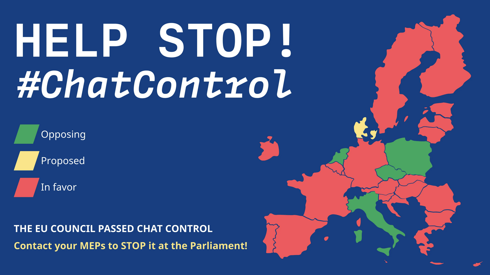
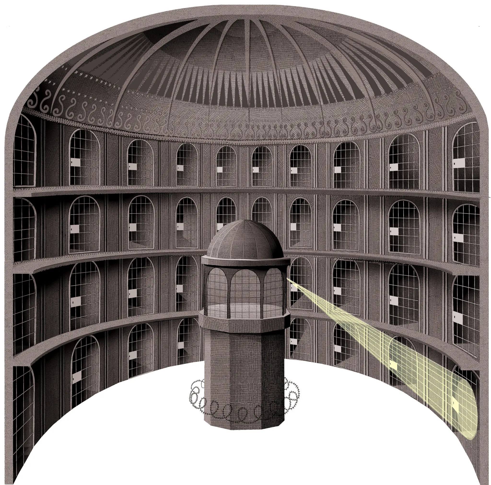

> _L'accumulation centralisée et incontrôlée d'informations sur les citoyens crée les conditions propices à un régime autoritaire. Il suffit de demander aux anciens Allemands de l'Est. C'est pourquoi, dans une démocratie, c'est le peuple qui détient le droit à la vie privée et le gouvernement qui doit agir au grand jour. Il ne peut en être autrement._ ([The Guardian, 30 janvier 2026](https://www.theguardian.com/commentisfree/2026/jan/30/ice-surveillance-app-mobile-fortify-authoritarian))

Il faut qu'on parle d'un truc.

Avez-vous déjà eu l'impression que votre téléphone vous écoute ? Que la coïncidence pour que cette publicité vous soit montrée 2 heures après avoir discuté de ce service ou produit précis en famille est trop invraisemblable pour qu'on ne vous espionne pas à longueur de journée ?

La réalité est qu'Alphabet (Google), Amazon, Meta (Facebook), Apple, Microsoft et consorts, que l'on appelait il y a quelques années les GAFAM, n'ont même pas besoin d'écouter. Ils savent déjà **tout** de vous, sans devoir dépenser une énergie faramineuse à scanner 5 milliards (nombre de smartphones en circulation) fois 16 heures (disons la durée d'une journée type) d'hypothétiques enregistrements audio par jour. Il est bien plus facile d'obtenir plus d'informations par d'autres moyens.

## L'économie de l'information

C'est grâce à la myriade de données que nous produisons nous-mêmes au cours de la journée que ces entreprises font leur business. Les réseaux sociaux que l'on consomme et qui connaissent tous nos goûts, les cookies et trackers présents sur la majorité des sites internet qui connaissent tout de notre navigation, et nos appareils, qui en s'approchant des différents réseaux wifi et en se connectant aux antennes connaissent tout de nos déplacements. Tout cela permet de construire un profil utilisateur fort de milliers de points de données. La collecte d'informations n'a donc même pas besoin de micros ou de caméras, elle est passive grâce à l'agrégation de nos données et leur analyse par algorithme.

Un seul exemple : la qualité hallucinante des recommandations Spotify, proposées par l'algorithme entrainé sur vos **seules** données d'écoutes musicales, qui vous connait mieux que vous-même. Imaginez la taille de votre profil de données enregistré sur les serveurs de Google, qui eux ont : vos e-mails, votre calendrier, vos photos, vos déplacements effectués avec Google Maps, votre historique de recherches et vos longues et profondes conversations à son IA Gemini (l'équivalent de ChatGPT). 

Bon, mais à quoi servent ces informations ? À nous proposer de la publicité ciblée, qui aura plus de chance de générer un clic intéréssé qu'une publicité aléatoire. Nos informations ont la réelle valeur d'une monnaie, que nous échangeons contre la fourniture d'un service, le plus souvent gratuit. Malaise quant à la quantité d'informations collectées plus ou moins dans mon dos mis de côté, cela ne me pose personnellement pas de problème existentiel. Je suis le premier à écouter mon résumé Spotify "Wrapped" en décembre, après tout. 

Mon problème est ailleurs. Mon malaise est plus grand. Et cette longue introduction n'avait d'objectif que de vous faire rendre compte de la quantité délirante de données que nous produisons, de la facilité avec laquelle on peut les collecter, et de l'acceptation ignorante ou passive dont nous faisons preuve à l'égard de cette collecte.

## Vers un contrôle de l'information

Les journaux et chaînes d'informations ne sont depuis quelques mois pas en manque de sujets à traiter, dans un monde en constante ébullition. Il n'est donc pas étonnant du peu d'attention accordée à ce sujet, et en retour du peu de préoccupation générale.

Ce sujet, c'est **celui du renforcement constant du contrôle de nos informations par les organismes gouvernementaux**: nationaux, supra-nationaux et étrangers. 

### L'exemple européen : Chat Control

L'Union européenne cherche depuis quelques années une solution pour lutter contre la pédocriminalité. Elle pousse pour implémenter le "Chat Control" : un scan automatique, obligatoire de chaque message envoyé par tout citoyen. Pour en comprendre toutes les implications, un court passage technique s'impose.

**Chiffrement.** Quand une conversation est non chiffrée, les informations voyagent "en clair" sur le réseau. N'importe quel observateur sur l'appareil (par exemple, la messagerie Instagram) ou sur le réseau (par exemple, la NSA ou la DGSI) peut lire et sauvegarder la conversation. Quand une conversation est chiffrée, un algorithme mathématique convertit les messages en une suite de caractères déchiffrables uniquement grâce à l'utilisation d'une clé. Seuls l'expéditeur et le destinataire possèdent cette clé, rendant toute tentative de déchiffrement par un acteur tiers impossible _mathématiquement_. C'est une excellente pratique pour protéger son droit à la vie privée: toute correspondance ne devrait être portée qu'à l'attention des destinataires.

Une des propositions phares du Chat Control est la comparaison obligatoire par toute application de messagerie du contenu envoyé, notamment les photos, à une base de données de contenu pédopornographique. Chaque envoi qui matche une entrée de la base de données est reporté à la police automatiquement. Une bonne idée au premier abord...?

**Le premier problème est celui de la casse du chiffrement.** Pour scanner un message, il faut autoriser un tiers à le comparer à la base de donnée. La promesse que sa correspondance ne soit lue que par soi et son destinataire est donc brisée [^1]. Affaiblir le chiffrement c'est aussi ouvrir la voie à des risques accrus de piratage et de divulgation (données financières, judiciaires, journalistiques, médicales).

**Le second problème est celui du précédent.** À partir du moment où l'on autorise et implémente techniquement ce système qui cible à l'origine les pédocriminels, n'importe qui peut ajouter du contenu à cette base de données sans audit préalable. Impossible en démocratie ? Il suffirait pourtant d'une passation de pouvoir vers un exécutif (à peine) moins regardant, qui déciderait simplement d'ajouter d'autres contenus à détecter à cette base de données.
Le risque est fort de livrer un système clé en main au Rassemblement National en 2027, qui pourra décider de cibler les immigrés, à la Hongrie de Victor Orban pour cibler les LGBT, ou à la Pologne conservatrice pour cibler et reporter les tentatives d'avortement. 

**Le troisième problème est celui des faux-positifs.** Tout envoi d'image suspect, même au sein d'un cadre légal et consentant (par exemple, des photos de vacances, ou bien un échange entre deux adolescents) peut potentiellement être reporté auprès des autorités policières et judiciaires. En plus de placer de fausses accusations sur des personnes innocentes, les experts sont sûrs que la quantité gigantesque de faux-positifs  aurait un effet contre-productif en engageant pour l'examen de chaque dossier des moyens faramineux qui pourraient être mieux employés pour des enquêtes ciblées et mandatées judiciairement. 100 milliards de messages sont envoyés quotidiennement sur Whatsapp. Même en considérant un ratio négatif de 99.99%, 10 millions de messages devraient être analysés par des humains chaque jour. Et c'est seulement sur Whatsapp !

**Le quatrième problème (et pas le dernier, mais promis après j'arrête) est celui de la légalité hautement contestable de cette mesure.** L'idée de surveillance généralisée sans ciblage proportionné et encadré par un contrôle judiciaire est probablement illégale et une atteinte aux droits fondamentaux des citoyens, garantis par de multiples textes tels que la Charte de l'UE ([article 7 & 8](https://fra.europa.eu/fr/eu-charter/article/7-respect-de-la-vie-privee-et-familiale)) ou la Constitution ([Article 2](https://www.senat.fr/questions/base/2009/qSEQ091110883.html)) en France. 

L'exemple du Chat Control est révélateur. Il prépare un précédent à la surveillance généralisée en partant d'une fausse bonne idée, mal étudiée techniquement et contraire aux textes fondamentaux des Droits de l'Homme.

### L'exemple international : la segmentation d'internet par la vérification de l'âge

L'Assemblée Nationale a voté ce mardi 27 janvier l'adoption du [projet de loi d'interdiction des réseaux sociaux aux moins de 15 ans](https://www.assemblee-nationale.fr/dyn/17/textes/l17b2341_texte-adopte-commission#). Sur le papier, encore une idée qui paraît bonne. On sait les problèmes causés par les réseaux sociaux et surtout sur des cerveaux et psychés en développement et en besoin de temps à consacrer à d'autres activités d'éducation et de sociabilisation. 

La France ne serait que le deuxième (et sans doute pas le dernier) pays à adopter cette interdiction, après l'Australie. La formulation de l'idée met l'accent sur la protection des mineurs, contre laquelle il est compliqué d'argumenter. 

Le problème principal apparaît en formulant l'idée en sens inverse : pour accéder à un réseau social, tout citoyen devra montrer patte blanche en exposant ses données personnelles : âge et potentiellement identité complète, au réseau. Parmi les solutions envisagées :
- Une "preuve" par scan du visage et analyse par IA : c'est exposer l'utilisateur (par exemple à 16 ans) à une erreur de la machine (qui l'estime à 14) et se voir refuser l'accès à un site auquel il aurait le droit.
- Une preuve par envoi de document d'identité : dans son implémentation simplifiée et naïve, c'est exposer l'utilisateur à de probables futures fuites de données, qui s'enchainent depuis des années et n'épargnent aucun service, même gouvernemental ([URSSAF](https://www.urssaf.fr/accueil/actualites/pajemploi-vol-de-donnees.html), [France Travail](https://www.francetravail.org/accueil/communiques/2025/le-reseau-des-missions-locales-et-france-travail-appellent-a-la-vigilance-apres-un-acte-de-cyber-malveillance.html?type=article)). C'est aussi l'exclure s'il n'a pas de document d'identité. C'est enfin attenter à sa vie privée puisque le réseau aurait accès à son identité. Si les pouvoirs décisionnels choisissent cette méthode, il est **indispensable** de réfléchir à une implémentation technique poussée, qui permettrait de résoudre partiellement ce problème [^2].

Les exemples du [Royaume-Uni](https://www.theguardian.com/culture/2019/oct/16/uk-drops-plans-for-online-pornography-age-verification-system) et de [l'Australie](https://proton.me/blog/australia-social-media-ban-privacy) questionnent néanmoins sur la faculté des législateurs à implémenter une solution techniquement et éthiquement robuste (en assumant qu'elle existe). L'absence de solution aboutie préservant l'anonymat ou au moins le pseudonymat introduirait _in fine_ les mêmes problèmes qu'avec le Chat Control : risques accrus pour les journalistes ou activistes ne pouvant rester anonymes lors de leurs travaux de recherches, et dégradation du droit à la vie privée pour tous.

Je consigne un second problème d'ordre plus philosophique en note de bas de page car, quoique pertinent, il nous éloigne du sujet de l'érosion des libertés numériques [^3].

En guise d'antithèse nous pourrions établir qu'après tout, il faut également s'identifier auprès des sites pornographiques ([depuis 2025](https://www.economie.gouv.fr/actualites/protection-des-mineurs-en-ligne-les-sites-pornographiques-doivent-de-nouveau-controler)). Devrions-nous abolir toute vérification de l'âge sur ces sites et implicitement y ré-autoriser les mineurs au prétexte d'une préservation stricte du respect de la vie privée ? 
 
Je conclurai donc en reconnaissant que cet argument est juste et qu'il est tout à fait souhaitable de protéger les mineurs de ce type de contenu inadapté. Sous cet angle, et en assumant qu'un consensus sociétal et scientifique le motive, il semble donc aussi légitime de préférer protéger les enfants des réseaux sociaux. 

Je veux néanmoins mettre l'accent sur l'impératif de réfléchir à une implémentation technique sérieuse pour ne pas compromettre la vie privée de tous [^2]. Une progressivité des mesures de protection est à mes yeux également préférable à un blocage pur et dur. 

Malheureusement de gros doutes restent à ce jour quant à une législation poussant une solution technique responsable, principalement à cause [d'un agenda trop expéditif](https://projetarcadie.com/verification-age-reseaux-sociaux-mort-ne/), poussé par des politiques à l'inexpérience persistante en quête de victoire rapide et peu risquée (mais qui ne résout pas le problème sur le fond). 

## Le piège du complotisme : quelles motivations ?

Ces deux exemples reflètent les difficultés à naviguer entre différentes solutions: simples et absolutistes, ou complexes et progressives. La volonté de solutionner rapidement la protection des mineurs ou la protection contre le crime et le terrorisme, problèmes sur lesquels tous s'accordent, mais qui concernent une minorité, justifie souvent une implémentation à la va-vite qui impacte la majorité.

Bien souvent la pente est raide à partir du précédent établi par la proposition implémentée. Ainsi en France l'on entend maintenant [la ministre chargée du Numérique](https://www.franceinfo.fr/replay-magazine/franceinfo/l-invite-politique/l-invite-politique-du-vendredi-30-janvier-2026_7774163.html) prête à s'attaquer à un peu tout et n'importe quoi en utilisant les prétextes cités plus haut: "les VPN (N.D.R: réseaux privés virtuels, outils majeurs de protection de la vie privée qu'interdisent ou restreignent beaucoup de pays autocratiques comme la Russie, l'Iran ou la Chine), c'est le prochain sujet sur ma liste.". Ou encore la [secrétaire d'État britannique](https://www.irishlegal.com/articles/uk-home-secretary-dreams-of-ai-powered-panopticon) de littéralement déclarer vouloir créer un [système de surveillance panoptique](https://geoconfluences.ens-lyon.fr/glossaire/panoptique) à l'échelle du pays, dopé à l'intelligence artificielle.

Prison panoptique : surveillance centralisée et globalisée. _Source: [The New York Times](https://www.nytimes.com/2013/07/21/books/review/the-panopticon-by-jenni-fagan.html)_

Au fil de mes recherches, une question m'élude : **pourquoi diable s'obstiner à vouloir surveiller tout le monde, tout le temps ?** Ne serait-ce pas verser dans le complotisme que penser nos politiciens comme étant intrinsèquement sournois, mauvais et guidés par un agenda caché du commun des mortels ? J'ai plus de pistes que de réponses établies.

### La piste capitalistique

Plus de contrôle des données, c'est _in fine_ plus d'argent pour les milliardaires technocrates des GAFAM, comme vu en première partie. L'érosion du respect à la vie privée serait ici plutôt un effet de bord à la course à l'argent qu'un but en soi. Plus ces milliardaires et entreprises engrangent de l'argent, plus ils gagnent en pouvoir de lobbying des politiques. 

### La piste politique

Une volonté d'influencer un peuple qui perd en souveraineté, via plus de publicités ciblées par exemple. C'est ce qu'il s'est passé lors de l'affaire [Cambridge Analytica](https://fr.wikipedia.org/wiki/Scandale_Facebook-Cambridge_Analytica), où l'exploitation de données personnelles de 87 millions d'utilisateurs de Facebook a permis d'influencer les intentions de vote en faveur du Brexit en 2016, ou du parti républicain aux États-Unis. Le parti démocrate n'est soit dit en passant pas en reste avec un système similaire lors de la campagne pour Obama en 2012 avec le [project Narwhal](https://www.fondapol.org/decryptage/big-data-dis-moi-qui-tu-es-je-te-dirai-qui-voter/). 

[Encore aujourd'hui le parti Fidesz d'Orban](https://www.hrw.org/report/2022/12/01/trapped-web/exploitation-personal-data-hungarys-2022-elections) en Hongrie utilise des données personnelles acquises à partir de bases de données administratives nationales, pour influencer le résultat des élections en faveur du parti, mettant en surface un abus de position dominante évident.

### La piste de "l'auto renforcement invisible"

Il n'y aurait pas à proprement parler de volonté explicite à contrôler l'information et les communications. Juste une pente descendante qui se raidit de précédent en précédent ([effet cliquet](https://fr.wikipedia.org/wiki/Effet_cliquet#En_droit_des_libert%C3%A9s_fondamentales)).

Les gouvernants sont incités à mettre en place des mesures de protection des populations en réponse à des menaces à faible impact mais bien visibles : terrorisme, pédocriminalité. Il suffit de se rappeler de la réponse disproportionnée des États-Unis après les attentats du 11 septembre : l'invasion totale de l'Afghanistan pendant 20 ans et la mise en place d'un système de surveillance domestique et international par la NSA sous couverture du [Patriot Act](https://en.wikipedia.org/wiki/Patriot_Act). 

Les populations n'ont pas conscience de l'autre face de la pièce : des dangers moins visibles, mais plus pernicieux et étendus. L'érosion de la vie privée, tendant potentiellement et progressivement à un totalitarisme numérique, lui-même tendant à une érosion des systèmes démocratiques. L'ironie du sort ? C'est exactement ce que veulent les terroristes : que la civilisation occidentale se saborde de l'intérieur à moindre effort. 

Bien souvent enfin, ces mesures de "protection" sont implémentées par des organes dérivés de l'exécutif, sans mandat direct établi par le peuple : NSA pour le Patriot Act, Commission européenne pour le Chat Control. Il est autant plus difficile de réaliser l'étendu des mesures et des conséquences.

## Quelles conséquences ?

Justement, quelles conséquences pour le citoyen lambda ?

### Une vie en vente à 5€ sur le dark web

Le blogueur Korben a écrit un très bon [article sur le sujet des fuites de données récurrentes](https://korben.info/hacks-france-2025-bilan.html). Il ne se passe pas un jour sans qu'une entreprise ne reconnaisse avoir été victime de piratage, et avoir fait fuiter les données de ses clients. C'est aussi valable pour les services de l'État, comme vu plus haut pour France Travail ([décembre 2025](https://www.francetravail.org/accueil/communiques/2025/le-reseau-des-missions-locales-et-france-travail-appellent-a-la-vigilance-apres-un-acte-de-cyber-malveillance.html?type=article)) ou l'URSSAF ([novembre 2025](https://www.urssaf.fr/accueil/actualites/pajemploi-vol-de-donnees.html)). 

Le résultat ? Avec la myriade de données sauvegardées par tous les services que nous utilisons, il devient facile de croiser les données pour créer un profil contenant l'intégralité de nos données et de vendre ce profil à la sauvette à des arnaqueurs. C'est la recrudescence des arnaques au faux colis (facile d'être crédible : votre adresse a déjà fuité), ou au faux conseiller bancaire (facile d'être crédible : votre RIB a déjà fuité).

Il est impossible de garantir une sécurité inviolable. Il faut donc partir du principe que les fuites de données sont inévitables, et à ce titre, tout faire pour minimiser sa trace numérique. Pas facile lorsque les gouvernements choisissent la voie de l'érosion du chiffrement des messageries (cf. Chat Control) ou celle de nous demander toujours plus d'informations (cf. vérification de l'âge). 

### Big Brother boosté à l'IA

Les technologies de surveillance des réseaux et l'Intelligence Artificielle deviennent si puissantes et répandues, qu'un futur à la 1984 n'est plus exclu. Imaginez si l'URSS avait eu accès à ces technologies. Il aurait été facile pour le pouvoir de détecter toute pensée en contradiction avec l'idéologie étatique avant même qu'un citoyen n'en ait conscience. Dans une moindre mesure, on voit déjà ces technologies de contrôle avancé appliquées en Chine ou en Russie. 

Mais pas besoin d'aller dans des pays autocratiques, il suffit aussi de traverser l'Atlantique. Aux États-Unis [The Guardian rapporte](https://www.theguardian.com/commentisfree/2026/jan/30/ice-surveillance-app-mobile-fortify-authoritarian) comment l'application Mobile Fortify permet à la force ICE d'accéder à une montagne d'informations sur un simple scan de visage dans la rue. L'application est utilisée par ICE, instrumentalisée par Trump, pour interpeller violemment et aléatoirement n'importe quel individu, souvent sans recours immédiat en cas de faux-positif. Comme le [résume Korben](https://korben.info/mobile-fortify-ice-certificat-naissance-algorithme.html), "c'est l'inversion totale de la preuve où un algorithme devient plus fiable qu'un document officiel."

### Hypocrisie des élites

Finalement, un ultime aspect dérangeant : l'hypocrisie des "élites" gouvernantes. Pour rebondir sur l'actualité il suffit de considérer le nombre de témoins, voire complices, parmi les chefs d'états, ministres et députés en tout genre mentionnés dans les fichiers Epstein. L'argument de la protection des enfants, du moins venant de ces "élites", perd un peu de son sens, non ?

Un autre aspect controversé des propositions d'implémentation du Chat Control est que [les politiques au sens large en seraient exclus](https://www.eureporter.co/business/data/mass-surveillance-data/2024/04/15/leak-eu-interior-ministers-want-to-exempt-themselves-from-chat-control-bulk-scanning-of-private-messages/). C'est une reconnaissance des dangers que posent l'affaiblissement des mesures de confidentialité et de chiffrement, mais cela montre aussi que les politiques ne veulent pas supporter les conséquences de leurs actes imposés au reste de la population. 

Ce traitement double, cette hypocrisie, à terme, érode la confiance des peuples dans ses instances représentantes, ainsi qu'en la démocratie.

## Que faire face à ces constats ?

On le voit donc, le respect à la vie privée, dans le monde physique comme dans le monde numérique est **inaliénable**. Il existe tant d'arguments supplémentaires :

- [Alex Winter](https://www.youtube.com/watch?v=luvthTjC0OI?si=w-FKzEXNZTyahcb0&t=791) n'accepte pas l'idée que si nous n'avons rien à cacher, nous n'avons rien à craindre: "La vie privée a son utilité. C'est pourquoi nous avons des stores à nos fenêtres et une porte à notre salle de bain".

- [Edward Snowden](https://www.reddit.com/r/IAmA/comments/36ru89/comment/crglgh2/) soutient que "prétendre que vous ne vous souciez pas du droit à la vie privée parce que vous n'avez rien à cacher revient à dire que vous ne vous souciez pas de la liberté d'expression parce que vous n'avez rien à dire. [^4]

La première action et la plus importante est donc d'établir l'importance fondamentale du respect à la vie privée, et du minimalisme numérique par défaut. 

Il est indispensable d'éduquer sur ces sujets de fond, qui reçoivent trop peu d'exposition médiatique.

En dénonçant l'application de mesures désignées comme "de protection", il ne s'agit pas de se mettre du côté des pédophiles, des criminels ou des terroristes. Il s'agit de dire que l'on est pas d'accord pour l'application de tout et n'importe quoi au titre de ces combats. Plutôt que des demi-solutions erratiques à la va-vite, il s'agit d'apporter des réponses ciblées, progressives, transparentes et scientifiquement établies.

Je prépare aussi un article sur les solutions que l'on peut adopter, à son échelle, pour limiter les dégâts. À suivre...!

# Références

[^1]: Un contre-argument est qu'il ne serait pas nécessaire de briser le chiffrement pour effectuer un scan des messages, si celui-ci s'effectue en local, sur la machine. C'est en théorie possible, [mais les experts sont très douteux de la mise pratique](https://www.eff.org/deeplinks/2019/11/why-adding-client-side-scanning-breaks-end-end-encryption), et estiment qu'à terme il y ait de grandes chances pour que le matching se fasse sur un serveur distant contrôlé par un tiers. 

[^2]: Il s'agit ici de la [technique du double anonymat](https://www.franceinfo.fr/societe/pornographie/controle-de-l-age-des-visiteurs-de-sites-pornographiques-comment-fonctionne-le-double-anonymat-concu-pour-proteger-les-donnees-des-internautes_7179942.html). Au lieu d'envoyer directement un document d'identité complet au réseau social directement, l'utilisateur génère un "jeton d'âge" auprès d'un vérificateur agréé. Il peut ensuite l'utiliser auprès de n'importe quel réseau sans que son identité n'y soit rattachée (https://openageinitiative.org). 

[^3]: Interdire les réseaux sociaux (voire d'autres applications et sites lorsqu'un précédent sera établi) aux moins de 15 ans, c'est extraire [17% de la population](https://www.statista.com/statistics/464032/distribution-population-age-group-france/) du forum public que sont les réseaux sociaux. Pour tous leurs mauvais côtés, les réseaux sociaux ont également un rôle sociabilisant, éducatif et d'ouverture au monde lorsqu'ils sont maîtrisés avec responsabilité. Le philosophe Roger-Pol Droit pose par exemple la question de l'apprentissage à détecter le vrai du faux sur les réseaux ([émission C À Vous du mardi 27 janvier 2026](https://www.france.tv/france-5/c-a-vous/saison-17/8078280-emission-du-mardi-27-janvier-2026.html)). À la place d'une interdiction pure, il propose d'éduquer à l'esprit critique, par une meilleure utilisation desdits réseaux. [La plupart des jeunes ne savent pas distinguer les vraies informations des fausses](https://www.latribune.fr/technos-medias/medias/la-plupart-des-jeunes-ne-savent-pas-distinguer-les-vraies-informations-des-fausses-619236.html). Plutôt que d'être lâché dans le grand bain d'un coup à une arbitraire "majorité numérique", il serait donc important d'apprendre progressivement à se servir correctement des réseaux sociaux.

[^4]: Cet argument du "je n'ai rien à cacher" est fallacieux : même si c'est votre cas, ce n'est pas le cas de votre voisin, de votre sœur, d'un lanceur d'alerte ou d'un journaliste. Un exemple : [le gouvernement US peut dès à présent demander à Google une liste de personnes ayant cherché des termes spécifiques](https://korben.info/pennsylvania-court-google-keyword-search-warrant.html). Le précédent est donc en place pour que n'importe quel gouvernement extrémiste puisse demander à Google  puisse demander à Google de lui fournir une liste des personnes qui ne rentrent pas dans sa liste de critères bien définis. Cela correspond par exemple à un activiste alertant sur l'anticonstitutionalité de certaines pratiques gouvernementales ([Edward Snowden sur PRISM](https://fr.wikipedia.org/wiki/PRISM_(programme_de_surveillance))), ou au Texas, à une femme en détresse qui souhaite avorter.

## Pour approfondir:

- https://ssd.eff.org/
- https://fightchatcontrol.eu/
- https://korben.info/categories/vie-privee-anonymat/