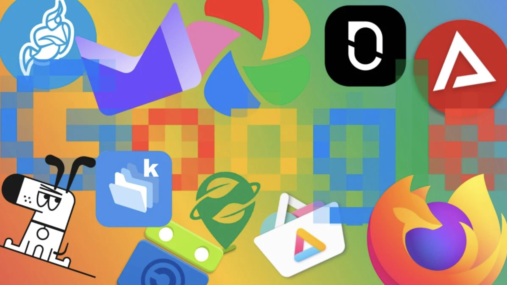
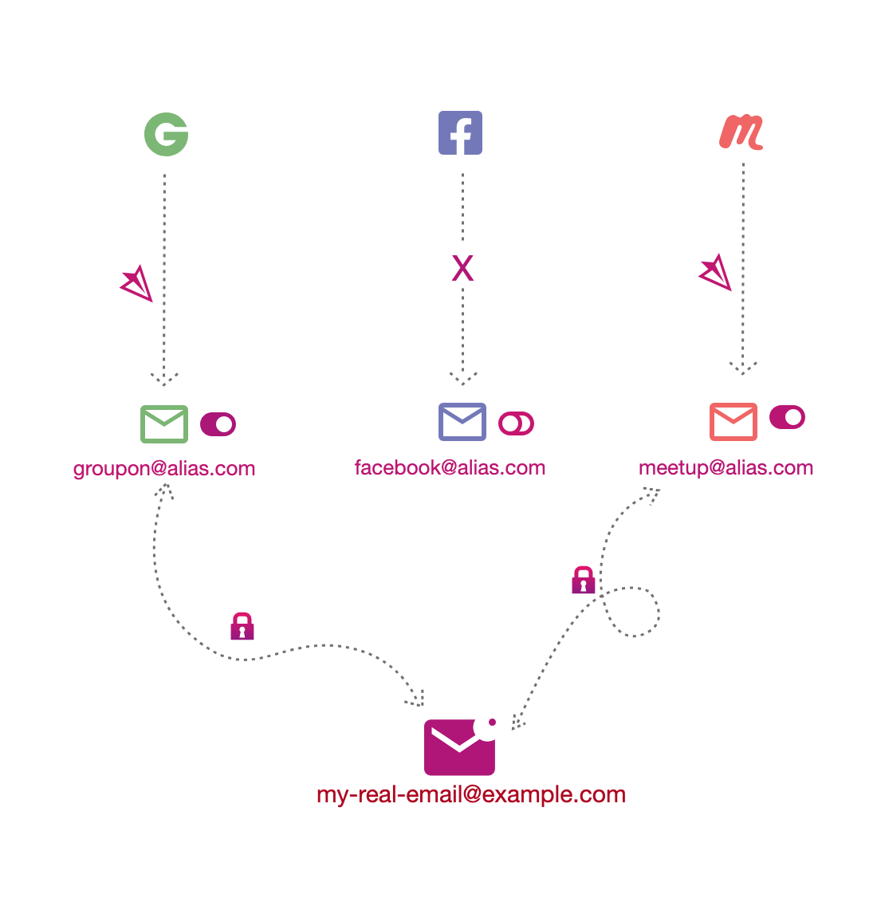

🇬🇧 _Howdy English speaker, please note that this article was translated from French using [Duck AI](https://duck.ai/), a privacy-friendly AI._

## Some Solutions (Part 2)

After learning about the constant progress of surveillance and control of communications and information by numerous entities in [part 1](../../02/privacy/index.en.md), here are some ideas to mitigate the consequences.

They are sorted from the simplest to implement, with no particular effort, to the most complicated, which will require accepting some compromises in comfort. There is no need to overhaul all your habits at once; it is better to proceed step by step. Perfection does not exist, but it is always possible to improve gradually.

## Educate Yourself
The first step: inform yourself, be aware of the mechanisms at work. Reading this series of articles is a good start.
During any public debate, for example about Age Verification to access various websites, do not fall into the trap of simplistic arguments that only explore one side of the debate. Being against this proposal does not mean you are in the camp of pedophiles; it simply means you are advocating for a calm and scientifically based debate to avoid sacrificing the fundamental freedoms of the majority.

## Minimize
One of the first measures to implement that costs nothing: what the [CNIL](https://en.wikipedia.org/wiki/Commission_nationale_de_l%27informatique_et_des_libert%C3%A9s) calls [minimization](https://www.cnil.fr/fr/definition/minimisation). Seeking to reduce your exposure surface, i.e., the number of sites or applications that contain your information, reduces the risk of data leaks or misuse.
One example. Enter your email address on [https://haveibeenpwned.com](https://haveibeenpwned.com/) (it is safe), to realise how many sites you are registered on have been hacked. For each site, you will find a list of all the information that is now out there and has probably been sold for next to nothing to scammers. Scammers who now send you, in the best-case scenario, SMS or phishing emails about "a package that could not be delivered," or who call you pretending to be your bank advisor. In the worst-case scenario, they set up fake SEPA direct debit mandates to attempt micro-withdrawals from your account ([a well-explained case by Numerama following a data leak from Basic-Fit servers](https://www.numerama.com/cyberguerre/2231417-fuite-de-donnees-basic-fit-les-coordonnees-bancaires-sont-concernees-que-risquez-vous.html)).

Ask yourself the question, "Is it necessary to create an account on this new site or this new application?" A simple trick: wait until the next day before creating the account to have time to think and realise that it might not be necessary. It is **much** harder to delete an account and the corresponding data than to create one, as many poorly coded sites do not allow you to change your personal information.

## Delete Your Internet Traces
But what to do when you want to "minimize" afterward, after having created accounts everywhere? Several data deletion services exist. For a few euros, they promise to list all the sites you are registered on and then automatically send deletion requests.
**Do not** use these services. [It has been demonstrated that](https://inteltechniques.com/blog/2023/09/19/the-dangers-of-data-removal-service-doxxing/) the deletion requests actually send more information to the sites than they had initially. This obviously goes against the intention to minimize your exposure surface.

Instead, send the account and data deletion request yourself. This right is guaranteed by the GDPR in Europe. You often find a contact email address in the terms and conditions of use of the site in question. A simple model that worked in 100% of the cases where I used it:

> Please delete my account and all corresponding data. As a European citizen, this right is guaranteed to me by the GDPR. I acknowledge that this means I will no longer have access to my account and its data, and I accept its immediate deletion.

The recipient then sends you a deletion confirmation a few days later. Fewer scattered data means fewer risks of future leaks. It is equivalent to cleaning up and picking up your trash.

And yes, sending these emails means you first need to remember which accounts you created earlier... Not always easy, but you can help find all your accounts using your password manager (this is described a bit further down).

## Reduce Your Existing Exposure Surface
Another step: delete any application you do not use on your phone (for example, any application you have not opened in 30 days). For reference, [every action you perform in any application can potentially be sent to a data broker or one of the Big Tech](https://tuta.com/fr/blog/app-tracking) (Google, Facebook). This is what allows building the most accurate user profile possible, not through a single application but through the entire device. **Everything** is good for advertisers: the weather application sends precise location data, the food delivery application sends precise data on eating habits... It is even more profiling points to then send you the most targeted advertising possible.

It is the same with browser extensions on the computer, which websites can query and use for massive data collection ([latest example: LinkedIn](https://www.blog-nouvelles-technologies.fr/364696/linkedin-browsergate-extensions-chrome-espionnage-fingerprinting-2026/)), or which are themselves a risk if their author has dishonest intentions ([Shadypanda case: how thousands of users had their session identifiers and other information stolen](https://continuumgrc.com/fr/ShadyPanda-et-extensions-de-navigateur-malveillantes/)).

Remember: each tool, application, extension, is an additional window of exposure and risk. So take a few minutes to open the list on your phone and browser, and delete both the account and the application of each service that is not strictly necessary.

## Reduce Information Collection from Your Phone
What about applications you cannot do without? Configure your phone to limit their tracking capabilities:
- [On iOS](https://support.apple.com/fr-fr/guide/iphone/iph4f4cbd242/ios): Settings > Privacy & Security > Tracking. Turn off "Allow Apps to Request to Track."
- [On Android](https://policies.google.com/technologies/ads?hl=fr): Settings > Privacy > Ads > "Delete Advertising ID."
This greatly limits the tracking possibilities of applications and "smooths" your user profile, making you less identifiable.

## Reduce Information Collection via AI
In the AI era, data collection by major tech companies is multiplied, both in quantity and quality. Users themselves provide their deepest thoughts to a somewhat opaque tool whose storage purposes, deadlines, and conditions are unknown. Consider all the data collected when exchanging with an AI: it knows the entire trip you are planning, the state of your finances when you ask for help calculating your taxes, or your health status when you ask about certain symptoms. Many users use AI as a complement or replacement for a psychologist. We enthusiastically share our deepest thoughts with foreign companies and accept that they record and use them *ad vitam aeternam* without us having the slightest idea!

It may be unthinkable within the current legal framework today, but it is not unimaginable that an insurance company will tomorrow question the companies behind the AI to judge the relevance of insuring a client. We cannot affirm with certainty that the legal framework will remain unchanged in the future, nor that companies will delete our data after a certain time. The probability even goes in the other direction: laws have always changed throughout history, and companies keep our data as long as they can for future uses that we do not even think about today.

So, what to do to reduce the value of the user profile built through our exchanges with AI?
Avoid at all costs sharing all the elements of your life, especially if what you gain in return is limited. I remember the Instagram trend of the "starter pack" (which I fell for), which consisted of describing yourself to the AI to ask it to generate your "starter pack" before being able to share it on social networks. The interest? A few minutes of dopamine when sharing the final photo. The benefits for Open AI or Google? Getting their hands on even more data to enhance the value of your profile that they sell to others.

In many cases, it is desirable to simply do without AI. But for the most advanced cases, AI remains a technology that is becoming difficult to set aside. For these, there are several chatbots, perhaps a bit less performant but promising more confidentiality to their users. I have not tried them all, but here are a few examples:
- https://duck.ai/
- https://lumo.proton.me
- https://confer.to/
- https://venice.ai/

Finally, there is the possibility of running AI locally rather than via the cloud. Your data thus remains on your machine. But in 2026, it is still significantly less performant and more complicated to set up, so rather than exploring this alternative in detail here, I will make it the subject of a future article.

## Prefer Encrypted, Local, Sovereign Solutions
The software and tools offered by major American tech companies are very comfortable to use. Clean user interface, ecosystem in which each tool interoperates, ease of sharing with other users... But all this comes at a price: these companies are using and monetising your data. To facilitate all these functionalities, they have no incentive to encrypt your data, which is therefore stored "in plain text" on their servers. The company, as well as the authorities, can access these photos, messages, personal files more or less freely. Picture Mark Zuckerberg and the police going through your mailbox, or sitting next to you in the living room when you browse your family photo albums.

What if I told you that it is possible to have 80 to 90% of the benefits and functionalities of Google, Microsoft, WhatsApp, and the like but without intrusion into your privacy? You just need to spend a little time looking for companies that provide the same services but are likely smaller in size and make respect for privacy their competitive advantage over tech giants.

For inspiration, here are some changes I have made:
- Replace your Google Chrome browser with [Firefox](https://www.firefox.com/fr/), with the [uBlock Origin](https://ublockorigin.com/) extension to block trackers on most sites. Bonus: the extension also blocks ads!
- Replace your Outlook or Gmail and Microsoft or Google Drive suite with [Proton](https://proton.me/fr), which offers: email, drive, VPN, password manager, document editor, spreadsheet, calendar, and videoconferencing. All fully encrypted. They themselves do not mathematically have the ability to access your data, and this also applies to any third party (authorities, hackers...). Proton is a Swiss, therefore European, company!
- Replace your messaging services (SMS, Messenger, Instagram, WhatsApp) with [Signal](https://signal.org/fr/), also end-to-end encrypted. No actor can read your exchanges. Mark Zuckerberg will no longer be able to enter your living room and listen to the conversations you have with your partner about your finances or the health of your children.
- Replace iCloud Photos (which nevertheless does a good job when iCloud encryption is activated...) and Google Photos with [Ente](https://ente.com/fr). Once again, everything is encrypted.

Use [this website](https://european-alternatives.eu/) to browse for more European Alternatives to Big Tech. The solutions are not always, but often respectful of personal rights. For the expert crowd, the [r/degoogle](https://www.reddit.com/r/degoogle/) subreddit provides a lot of good ideas as well.

Many of these services offer free plans, although you quickly reach their limits. Still, I think it's important to be willing to pay a few euros a month for services that don't make selling my data their business model. Smaller providers often do everything they can to compete with the big players, and they pamper their customers. Features appear much faster. You really feel like you're getting a better deal and you form attachments to these products more easily. It's like switching from fast food to a more local, healthy, joy-giving cuisine.
Finally, most have data migration services that facilitate the transition from the solutions of major tech companies. Of course, it is better to take your time and make these transitions step by step, to have time to get used to each one.

## Strengthen Your Passwords with a Password Manager
One of the worst things that can happen to you on the internet is the leak of the password you use on absolutely all the sites you are registered on. Remember [https://haveibeenpwned.com/](https://haveibeenpwned.com/): sites get hacked every day. If the site developers have followed good security practices, a hack does not necessarily mean that your password has been retrieved in plain text and is usable everywhere. But it is impossible to know in advance, so it is better to prevent than to cure. First tactic, as seen previously: reduce your exposure window by following the principle of minimization. Reduce the number of sites you are registered on.

For all the sites you are registered on, you should use a password manager to generate a **unique** password for each site. It is much less complicated than it seems. It is even more practical on a daily basis, as most managers have an auto-fill feature for login fields. This avoids having to remember your credentials and password and filling them in manually. And it works on your phone too!

What steps should you follow?
1. Download the browser extensions and mobile applications [Proton Pass](https://proton.me/fr/pass), or [Bitwarden](https://bitwarden.com/fr-fr/products/personal/), or the password manager of your choice after doing your research (obviously prioritize an encrypted solution and if possible, open-source).
2. Create a Proton or Bitwarden account via the extension. There is no need to do anything else for now.
3. On a daily basis, a popup from the manager appears when you log in to a site you use regularly. The manager automatically saves the credentials you have entered for this site; you just need to click "accept." During future logins, the site fields will be automatically filled in by the manager.
4. When you feel ready and have some time, renew your password on one or two sites via the account settings on the site. Use the password generation feature of the manager, which will create a unique and fairly complex password that will not be easily found by a potential hacker. Renew the experience for each of the sites you use, one by one.

Over time and after renewing all your passwords, the password of the manager becomes the only one you need to remember. You need to find one that is complex enough, but that you will always remember. I recommend a whole sentence (eventually one that means something to you), with numbers and special characters.

## Become Uncatchable
As a last resort, when creating an account on a site or application is indispensable, it is always possible to provide the least amount of information possible. Perhaps the phone field is optional. Or the postal address.
For email addresses, it is possible via certain services like [iCloud](https://support.apple.com/fr-fr/guide/icloud/mm074af79454/icloud), [Proton](https://proton.me/fr/pass/aliases) or [SimpleLogin](https://simplelogin.io/fr/) to create aliases. What is that?

Instead of always giving the same very personal email address to a multitude of websites, you create an alias per site. For example, instead of giving name.lastname@protonmail.com to your gym, you give the alias you have generated: alias-gym@passmail.com. The gym only sees alias-gym@passmail.com, but all the emails that the gym sends you arrive at name.lastname@protonmail.com. This has several advantages:
- In the event of a hack of your gym's servers ([hello Basic-Fit](https://www.lemonde.fr/pixels/article/2026/04/13/fuite-de-donnees-chez-basic-fit-un-million-de-membres-concernes-des-coordonnees-bancaires-piratees_6679702_4408996.html)), if your email is retrieved by a scammer, you will then see that spam arrives via this alias, which you can deactivate without having to deactivate your main address.
- Without talking about hacking, some companies do not hesitate to sell your data to brokers. You will know which ones when you also see spam arriving on a specific alias.
- Finally, separating your digital identity into a multitude of aliases complicates profiling by trackers when you browse multiple sites or applications.

An analogy in real life: giving the address of a mailbox in the city rather than that of your personal residence. In reality, not many people do this, as (fortunately) there are few reasons for this abundance of precaution and confidentiality, and maintaining a mailbox is expensive.
On the internet, however, there are fewer excuses, as the potential nuisance of spammers is much greater (they can flood you with phishing emails, which cost them $0) and maintaining an alias is free.

Your main email address, immutable unless you recreate an account, should be your most precious treasure, which should never leak or be exposed to the public. All other addresses can be treated as deactivatable at any time.

By using email aliases as well as passwords generated via your manager, you have a different identity per site, which trackers associate with a different user (especially if you deactivate most trackers with an extension like uBlock Origin), making your profiling much more complicated.
You become "anti-fragile": you stop relying on a single identity (corresponding almost to your intrinsic identity) that you share everywhere, which becomes a single point of failure if it ends up in the wild, and which exposes you to continuous spam. Instead, you use a multitude of identities that you can completely dissociate from. Activate and deactivate them on demand if one of them leaks. You become uncatchable.

## Spread Good Practices
Finally, these individual measures must be accompanied by collective awareness. Express your interest in these subjects during public debates and elections. Demand strict preservation of individual freedoms and respect for privacy. Demand that your government does not weaken encryption, but instead invest massively in targeted and judicially framed investigations. Support scientific enlightenment of the debate. There are many technical solutions that, if well implemented, can serve as a fair compromise.
Stay open and curious, do not be afraid to search for yourself and learn. Share your discoveries!