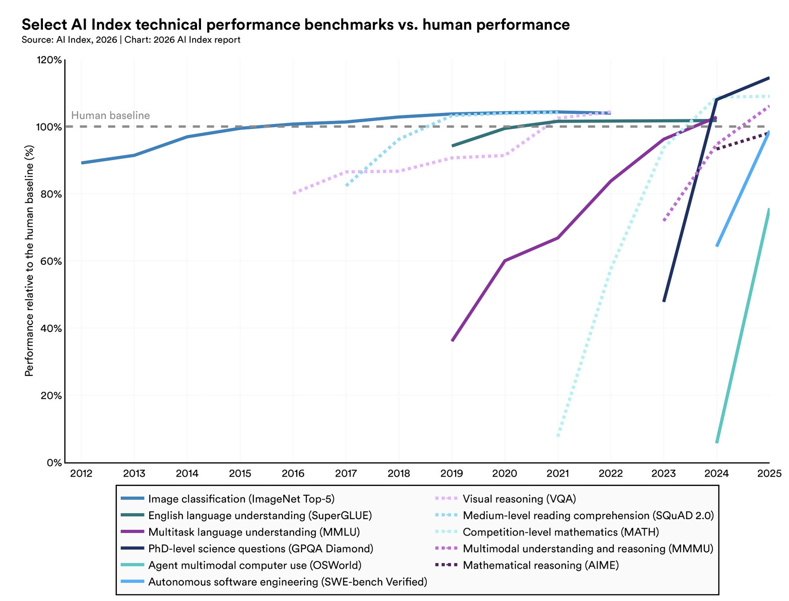
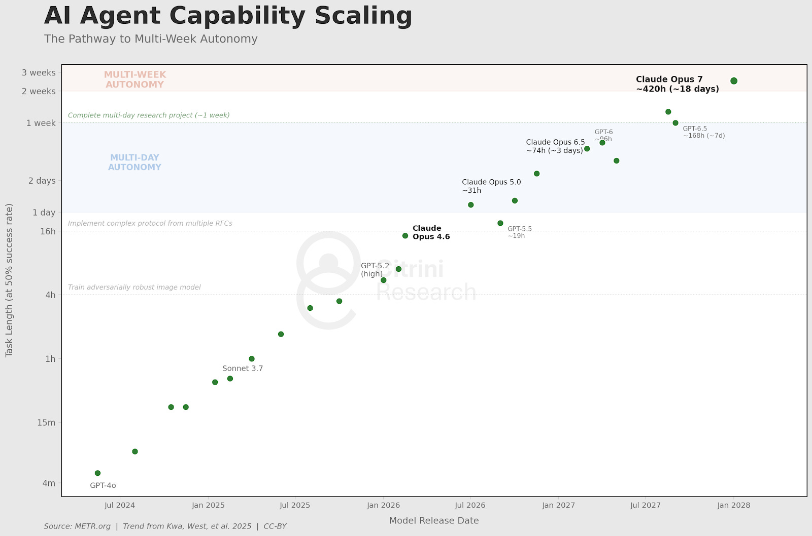
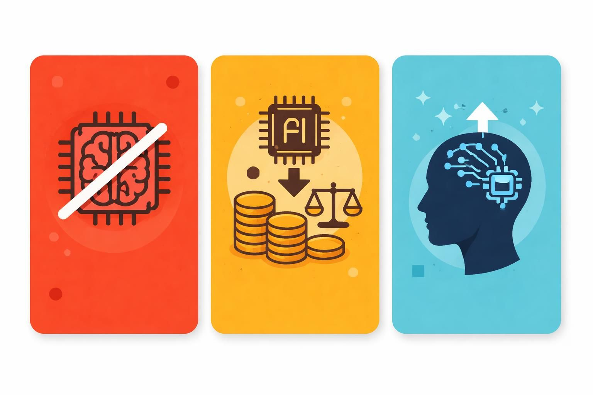

🇬🇧 _Please note that this article was translated from French using [Duck AI](https://duck.ai/), a privacy-friendly AI._

The idea of a potential Great Replacement by Artificial Intelligence (AI) is entirely absent from public debate, just one year before the French presidential elections. Political representatives engage in clientelism by blaming all of society’s ills (insecurity, debt burden) on different population groups (immigrants, the wealthy), regardless of where they stand on the political spectrum. The current ambition is short-termist and focused on the next electoral deadline, or even backward-looking as with the endless rehashing of yet another pension reform... Anything but than crafting a long-term societal plan and a vision for the future.

But technological progress doesn’t wait, it accelerates. In just a few years, the quality of AI-generated results has gone from laughable to worse than human, to on par, to better than the average human on specific tasks, including translation, marketing, graphic design, engineering, and research. Tasks once reserved for white-collar workers can now be performed by machines at lower cost and greater speed.

*Source: [2026 AI Index Report, Stanford University](https://hai.stanford.edu/ai-index/2026-ai-index-report)*

This is the official reason why many companies are massively laying off people today and stop hiring, mainly junior employees: [Meta just announced it would shed 10% of its workforce](https://www.bbc.com/news/articles/crm1y89vek8o), [Microsoft offered a voluntary separation plan for 8,000 employees](https://www.cnbc.com/2026/04/24/20k-job-cuts-at-meta-microsoft-raise-concern-of-ai-labor-crisis-.html), [Amazon has cut 30,000 jobs since October 2025](https://programs.com/resources/ai-layoffs/)... In short, it’s carnage in the tech sector. Overall unemployment figures don’t (yet?) reflect this reality, and we can certainly wonder whether the situation is merely cyclical or marks the beginning of a wave that will hit every industry. We can also question whether AI is the true cause of this job destruction. It’s likely that leaders who [justify these layoffs by citing some vague productivity boost from AI](https://fortune.com/article/sam-altman-ai-washing-tech-layoffs/) are actually concealing a difficult economic situation stemming from poor strategic decisions (for example, Meta’s massive investment in the metaverse in 2020: a flop), or a desperate attempt to gain an edge in the fierce competition among companies vying to capture the largest possible market share.

There’s no way to know for sure whether AI will tomorrow be a source of [creative destruction](https://fr.wikipedia.org/wiki/Destruction_cr%C3%A9atrice) like the industrial and digital revolutions, or if it’s a historical anomaly that will destroy more economic activity and value than it creates. [Several theories](https://www.citriniresearch.com/p/2028gic) suggest that a gradual rise in unemployment will lead to a loss of household income, triggering a demand crisis and a phantom GDP driven solely by computers.

Another equally important issue is the looming identity crisis when millions of people, who have been told for 200 years that work is a core component of their identity, realize that a machine can replace them overnight, and that no retraining is possible because every intellectual field is affected.

*This chart shows the exponential capabilities of AI models to handle increasingly complex tasks, along with an **estimate** of future progress if the trend continues. By 2027: a model could operate autonomously for 3 days. By 2028: for 3 weeks.*

One certainty... the uncertainty of the period opening up in the next 5 to 10 years. Sudden changes will impact millions of employees simultaneously. We must start thinking now about a societal model that can align with this rapid technological progress and shift the debate toward this fundamental issue, from which all others will follow. Without a viable societal model and social peace, it will be impossible to debate or legislate on other topics.

# What Economic and Social Model in the AI Era?
The challenge: How can we prevent societal unraveling while maintaining a quality of life similar to that of a "pre-AI" society?

The follow-up question: What economic system should we implement when AI replaces human labor and is no longer the primary source of income for the state and households?
Several solutions are typically considered.

## Slow Down or Ban AI
No AI, no replacement. No replacement, no change. No change... no change. Like a nuclear non-proliferation treaty, we could simply limit or ban the development and use of artificial intelligence.

The problem: We can ban it at the national or even European level, but other countries will continue developing it because they see a competitive advantage. Like it or not, AI is more efficient than humans at many tasks. Every country has an interest in staying in this race to avoid falling too far behind. Once Pandora’s box is open, there’s no closing it...

## Tax AI Provision and Redistribute Gains
A classic model already in practice: tax added value and redistribute it to those who need it most. If, in the future, only Big Tech companies creating and providing AI (OpenAI, Anthropic, Google...) capture the value, why not tax them even more than today to redistribute the gains as Universal Basic Income (UBI)?

This solution presents many pitfalls: 
- Logistical: Which companies are taxed? Their total revenue? Only the AI-related portion? On what basis?
- There would not be enough value to redistribute. [TaxProject.org](https://taxproject.org/paying-for-the-ai-transition/) estimates that the U.S. GDP would need to double just to cover the median household income. AI would need to introduce massive productivity gains for this solution to be feasible, especially if we also want to redistribute this added value globally. 
- This raises a question of sovereignty: What interest does the U.S., which hosts most of the Big Tech AI companies, have in redistributing these gains to the rest of the world?
- Loss of purpose and idleness when one’s identity is tied to work and that work disappears. Universal income is great, but what do people do with their days when they no longer work? 

Of course, an argument in favour of this solution is that it doesn't have to be all or nothing. UBI can be progressive and start as supporting a simple reduction of the work week duration for example.

## Enhance Human Flexibility to Compete with AI
A third often-cited idea is increasing labor market flexibility through continuous retraining. A graphic designer could be guided through this transformation by retraining as a solar panel technician. In practice this upskilling takes time (and isn’t always "humanly" possible). The problem is also mathematical: No amount of upskilling can offset job losses if automation destroys more jobs than it creates in other sectors.

One last idea proposed by some tech enthusiasts, [including Elon Musk](https://www.businessinsider.com/elon-musk-says-neuralink-help-humans-compete-with-ai-2024-8) is to facilitate symbiosis between humans and computers via neural implants and gradual hybridization, allowing us to compete with purely artificial intelligence. This solution isn’t feasible for at least a few more years.

# Less debated ideas
I recently came across two other solutions that seem more relevant to me.

## Tax AI Usage
Rather than vaguely taxing Big Tech companies that create and provide AI (a nationalization of capital verging on confiscatory), we could tax its *usage*. A theory I first heard in the [Silicon Carne podcast on March 28, 2026](https://open.spotify.com/episode/2D9XvankjdVL5m22cvDxfh?si=6618f457d7c54ebc) and that I later found labeled as the "token tax". It's about shifting taxation further down the value chain.

The idea: Any company that replaces human intelligence with AI is taxed based on its AI usage, which is easily measurable using the fundamental unit of AI consumption: the token. One token corresponds to 4 or 5 textual characters, and any AI action is measured by the number of tokens sent and returned between the user and the AI server.

So if La Poste (French postal service) decides to replace some of its sorting agents or customer service representatives with AI and consumes billions of tokens per day, we could implement a simple tax on token usage, redistributed to former employees. This avoids many logistical and geographical complications in calculating the tax. Even if, ultimately U.S.-based companies are providing AI, it's local companies using it in the value chain that are taxed by their own government.

Companies accept this taxation because in return, they maximize their gains and recognize that without redistribution there are no consumers to buy their products and services. Alternatively, with a zero or reduced tax, they can choose not to replace human intelligence with AI and continue employing workers.
Another advantage of the system is that it’s simple to implement. It relies on models and tax mechanisms already in place in every country since the invention of the welfare state in the 20th century.

Some argue this would deincentivize investing in automation, which could prove to be ultimately  beneficial in terms of quality of life, and would make us lag behind other countries taxing less. And in this model where humans work less, the "problem" of idleness also remains.

## Promote job creation
A solution to this problem, proposed by YouTuber Crésus [in a video from November 30, 2025](https://www.youtube.com/watch?v=qCAQP9PizTk), is not to support any universal basic income system but to promote jobs creation. The focus shifts from providing sufficient income to households to creating meaningful, responsible jobs for individuals.

Rather than centralizing this responsibility through the state, which has no profit imperative, it’s delegated to companies, which are naturally motivated to find useful and profitable jobs.

Crésus argues that many potential marginal activities aren’t currently covered by companies because they aren’t profitable enough. For example, imagine La Poste decides to close branches in towns with fewer than 10,000 inhabitants because the cost-benefit ratio isn’t attractive enough. The state could improve this ratio by reducing taxation, lowering La Poste’s costs so it can open branches in more towns. In exchange for reduced taxation, La Poste must create more jobs. Its goal is obviously to continue generating profit, so it must find jobs that are profitable for it. If, with high taxes, it wasn’t profitable to offer digital education workshops or bike repair services, now it becomes worthwhile to explore and fill these new marginal activities. Notably, these new activities could be primarily relationship-based: areas where humans can’t be replaced by AI. Society wins!

In summary, this aligns the goals of companies (profitability, sometimes through layoffs) with those of society at large (creating work that generates enough income to live with dignity). The tax system adapts to the number of jobs created by companies. Again, each company is free to choose whether to fully, partially, or not adopt this system, but will pay more or less tax accordingly.

# Keep Exploring the Possibilities
To conclude: There is also another, more optimistic scenario: the introduction of Artificial Intelligence across all layers of society could give rise to far more new jobs than it destroys overall. This is entirely plausible. It is my personal conviction, which I may explore in a future article. Even if AI’s technical capabilities are impressive and constantly improving, it will take years for economic actors to integrate and maximize its use. The transition will therefore take time.

But even in this scenario, millions of employees will need individual support and assistance in their retraining. This will coincide with a period when state tax revenues are at their lowest and expectations are at their highest, as demographic and ecological transitions unfold in parallel.
Sooner or later, therefore, we will need to consider alternative fiscal mechanisms. Ones that place less burden on the labor but more on capital. We must provide stronger incentives to utilize human intelligence and maximize it.

Many of the solutions mentioned here can be implemented in parallel and in a complementary manner. There are many other avenues society must continue to explore and debate. Pilot programs should be established to assess what works and what doesn’t. We must also coordinate at the European and global levels; otherwise, new fiscal mechanisms will only encourage economic activity to shift purely for optimization purposes.

Sources:
- https://www.citriniresearch.com/p/2028gic
- https://open.spotify.com/episode/2D9XvankjdVL5m22cvDxfh
- https://www.youtube.com/watch?v=qCAQP9PizTk
- https://www.youtube.com/watch?v=p_wl8KB0oME