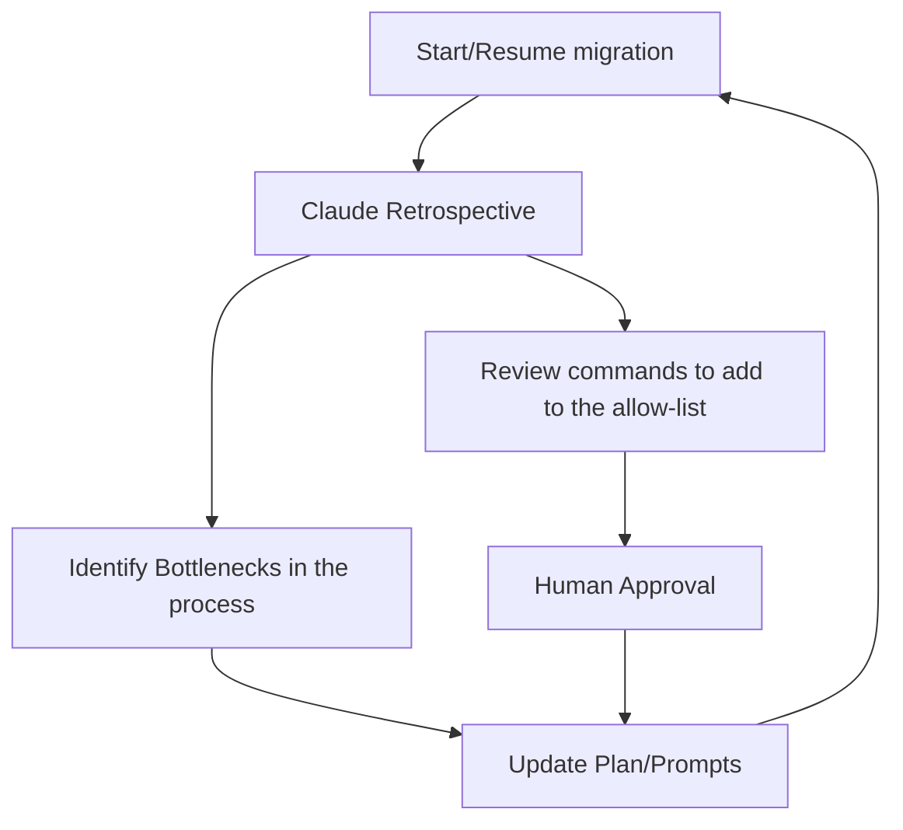

## The context
An interesting challenge to tackle in the CI world is how to keep up with dependencies. How to stay up to date when your product requires hundreds or thousands of packages, tools, SDKs, and sometimes services that rely on each other. On one hand you could decide to always use the tip (latest), which puts you at risk of a bad surprise on a random Tuesday morning if the new version of a dependency suddenly introduced a breaking change. On the other hand, you could pin all the updates, and hope to never forget to update them manually.

Neither approach is sustainable. Which is why at my current company we make heavy use of [Renovate](https://github.com/renovatebot/renovate), a tool that automatically re-pins all the pinned dependencies in our CI systems, whenever a new update is released.
This automates a big chunk of a boring aspect of the job, however what we gain in daily automation we partially need to pay in maintenance of Renovate itself.

We're dealing with a large codebase, consisting of many repositories, packages and tools. Furthermore, we need to integrate with out own internal registries, where these packages and tools are published. All of this grants a custom fork of Renovate and a custom configuration for our self-hosted instance. But we've got this covered and now the setup is smooth, automated, to the point that repository owners can automatically merge dependency update Pull Requests (PRs) most of the time, without noticing. 

The challenge arises when we need to push a breaking change to Renovate. We want to obviously make it invisible for the downstream teams as much as possible. I was in charge of such an update recently, so I'd like to share the process I followed, what worked and what I'd do differently. 

## The problem
The feature I got rid of in our custom instance of Renovate was causing a maintenance liability with some uncovered edge cases. The good thing? The feature we re-coded ourselves in the fork actually became supported in a later version of the official Renovate through a new configuration entry. That meant we "only" needed to update our own hosted version and the configuration of all client repositories. The problem: there were more than 50 of these. And each had a different, specific configuration setup.

An old-school process would look like: 
1. Clone the repositories one by one, and for each:
2. Understand the configuration setup
3. Write specific code adapted to the repository configuration
4. Push the update and create a PR following each repo's contribution guidelines

That looked... painful. In my estimate the cost of doing that was around 30hours of engineering time. 
Of course the alternative was to let the teams know, and get a mandate to motivate them all to individually own and implement their migration. In that case the cost would have been lower for me, but probably bigger for the company when accounting for network and communication overhead effects. And I was dreading chasing and repeating myself individually to each team.

Another alternative was to use a large-scale migration tool such as [Sourcegraph's Batch Canges](https://sourcegraph.com/batch-changes) feature: write a template of the migration, point it to a list of repositories, and it will handle the migration by itself. But the almost-similar-but-slightly-different aspect of each repository was an issue as a templated migration would not have fit everywhere.

## The approach
So here's the obvious: I called my buddy Claude to the rescue. This kind of task is a great fit for AI because the level of intelligence required is neither too basic that tools like Sourcegraph Batch Changes could do it, nor too complex that a human would be needed at each step of the process.

| Metric                | AI-Assisted Migration            | Manual Migration (myself)                                         | Manual Migration (decentralized)                                   |
| --------------------- | -------------------------------- | ----------------------------------------------------------------- | ------------------------------------------------------------------ |
| Time                  | **5 hours**                      | 30 hours                                                          | 30+ hours                                                          |
| Cost                  | **$80**  + 5h x engineer hour | 4-digits $ (30h x engineer hour)  + (30 - 5)h opportunity cost | 4-digits $ (30+h x engineer hour)  + (30 - 5)h opportunity cost |
| Risk of Errors        | **Medium** (human review)        | High (human implementation & review, fatigue)                     | High (human implementation & review, fatigue)                      |
| Coordination Overhead | **Low**                          | Low                                                               | High                                                               |

Here was my workflow:
1. Start a new repo for the migration itself. Version control it.
2. Manually add the only moving parts of this otherwise repeatable process:
	- The list of repositories that are impacted by the Renovate change in `repos.md`. 
	- The documentation about the new configuration/feature itself: how to migrate, how it should look like, etc, in `migration-docs.md`.
3. Prompt Claude in plan mode to only come up with a set of files for the migration. Do not start the migration itself at this point, just version control the following files resulting from the prompt:
	- `Claude.md`
	- `orchestrator-plan.md`: the complete plan
	- `orchestrator-prompt.md`: the prompt that can be reused across different sessions/days. It's important to make it resumable, depending on how many repositories there are to update and the complexity of the task.
	- `progress.md`: claude will update it after each repository migration. 
	- `.claude/settings.local.json`: list of allowed/blocked commands.
4. Run claude sessions until the end of the migration, just copy/pasting the content of `orchestrator-prompt.md` each time, and monitor the checkpoints. If everything looks good at the checkpoint, approve the push operations and resume.

All in all: 5 hours (including communicating the change to teams and chasing up a few for missing push permissions), 80$ + the engineering time, and 56 repositories impacted.

An important part of the initial prompts and Claude workflow is to instruct it to run the migration by itself until a “review” checkpoint when you, the operator, will perform verification on the code that’s about to be pushed. Also ask it to list you all the high level changes for this checkpoint, and if it found anything unusual compared to the previous repositories it migrated (diverging configuration, blind spots...). Finally, ask it to list all the commands it was blocked on (that the operator needed to approve manually), and add the safe ones to Claude's allow-list.

## Learnings
- The migration could be long. Make it so the plan can be resumed across different sessions. Store progress in a `progress.md` file.
	- Note: a loop on a remote machine is also an option, but in that case you lose the operator review checkpoints.
- Tell Claude to always review before git commit/git push. Overall, be extra conservative. Start by reviewing each command it asked permission for. Then allow some more as you grow more confident in the process. 
- Feedback loop: ask Claude to retrospect on the last repository migration:
	- “Identify bottlenecks and inefficiencies in the last migration. List them for review and improve the plan to get rid of these.”
	- “List all the commands you asked me permission to run and for each, suggest me to add them to the permissions.allow list. I will say yes or no”.
		- I had moderate success with this. [Claude's auto-mode](https://code.claude.com/docs/en/auto-mode-config), introduced after this migration, would have made it easier and freed me more time, not having to approve a lot of commands manually.
- Be anti-fragile (plan for failure): At some points PRs couldn’t be pushed because I was missing the permissions. Instead of asking the repo owners to let me in one by one, I included a fail-safe path in Claude's prompt to ask it to create a diff file if it could not push. I could then send it to the repo owner for them to implement.
	- Back to the feedback loop point: adapt the workflow and tell Claude to update the plan when such road bumps happen (hence the importance of version controlling the plans, prompts and setup).

## How this applies to you
This workflow is entirely reproducible, with very few moving parts that can modular (just provide a `docs.md` with domain knowledge specific to the update you want to implement). Using AI agents here can save money and time by an order of magnitude. 

But it's not a silver bullet. It shifts the effort from implementing and writing code, to babysitting PRs with your own name on commits, and dealing with the operational overhead of reaching out to people, transparently explaining the migration and asking for permissions. But the good news is that these challenges are much less time-consuming to deal with than dealing with all aspects of such a migration manually.

If you're facing a large-scale update or migration, the bottleneck isn't the code anymore, it's coordination and risk management. A friendly, contributors-first policy should be the norm. Let both humans and agents contribute effortlessly on all parts of your codebase and focus on implementing solid guardrails with robust human review checkpoints.

_Need help for your next migration? [Let’s talk](https://www.linkedin.com/in/theopnv)._