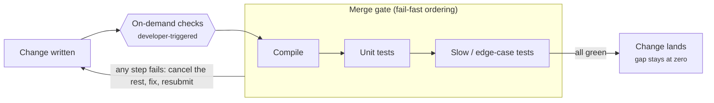
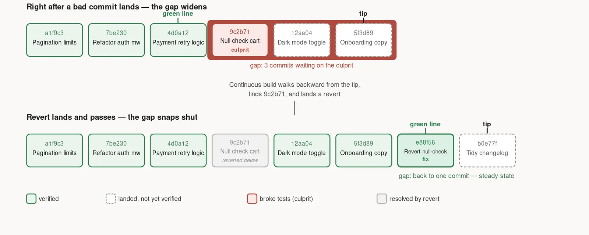
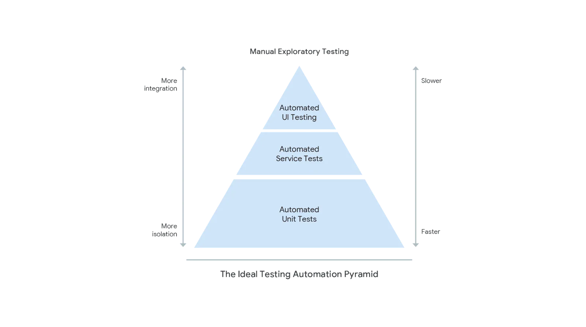

## The speed vs quality dilemma
[Last week](https://blog.theopnv.com/posts/2026/07/ci-speed-vs-quality/) I laid out one of the CI/CD (Continuous Integration & Continuous Delivery) engineer dilemmas: cover more (improve quality), or deliver faster (improve speed). Brute-forcing both by throwing more machines at the problem works for a while, then stops working when the test suite runs for hours and rarely comes back green on the first try. But speed and quality don't have to trade off against each other, and there are ways to speed up integration and delivery, while aiming for high quality. All you need is listing your requirements (more on that later), in order to choose the best strategy.

Here I want to explore two of these (there are certainly many others out there!), heavily inspired by:
- How Continuous Integration is done at Google, explained in ["Software Engineering at Google: Lessons Learned from Programming Over Time"](https://www.oreilly.com/library/view/software-engineering-at/9781492082781/), written by Titus Winters, Tom Manshreck and Hyrum Wright
- Some recommendations from the [DORA program](https://dora.dev/capabilities/continuous-integration/), which ["seeks to understand the capabilities that drive software delivery and operations performance"](https://dora.dev/).
- Some publicly available resources from the engineering blogs of [Airbnb](https://medium.com/airbnb-engineering/building-an-effective-test-pipeline-in-a-service-oriented-world-6968c513c6bd), Spotify and [Uber](https://www.uber.com/us/en/blog/bypassing-large-diffs-in-submitqueue/).

Let's dive in!

## The gap between "true head" and "green head"
Every software change starts as merely *written*. There's always some delay before the system can call it *verified*. Google calls the former "true head", and the latter "green head". When mapping that to a git setup, true head is the last change submitted, and green head is the one that has been validated against a suite of tests and showcases sufficient quality to be released.

To address our speed vs quality dilemma, an actionable question is: **how wide we let the gap between true and green heads be, and what we do to close it**. Let's explore two strategies and how they fit different teams' requirements.

## Strategy A: Avoid the gap before it opens (confidence earlier)
The contract for this strategy is: nothing lands until it's green (successful). There is no gap between the true and green heads, because the changes are verified before they land. 

A first checkpoint is developers running tests they deem relevant to validate their changes (or better: automate the tests running so that developers unfamiliar with the codebase and unaware of their blast radius don't have to deal with the selection). 

But the actual gate is coming when the changes are marked ready to land. Then all stable tests run against the changes and allow or block the landing.

This strategy ensures a certain level of quality at all times because all tests are successful before anything reaches the main branch and is made available to customers, or even internally. This is building confidence early in the integration and deployment process, which considerably simplifies reasoning when compared to the second strategy we will discuss below.

### What "never break the tip" costs as you grow
Here's the truth though: keeping the true and green heads perfectly pinned together gets more expensive as commit volume rises, because tests have to queue. 

As Titus Winters (ex-Google) puts it: 
>*"Having a 100% green rate on CI, just like having 100% uptime for a production service, is awfully expensive. If that is actually your goal, one of the biggest problems is going to be a race condition between testing and submission."*

### So is this the right strategy for your team?
One way to find out is listing all the attributes of your current environment, your constraints and your requirements:
- How many developers are in your team? How frequently do they commit changes? Do you anticipate a lot of growth soon?
	- If your team is relatively small this strategy could be acceptable as the finite resources will not be in constant high demand. 
	- Be aware this may become challenging entering an era where more and more AI agents contribute, which will increase the volume of changes by some orders of magnitude, even with a relatively flat number of human contributions.
- What is your blast radius per change? 
	- If your changes are scoped and tests are scoped to changes, this strategy could be acceptable as the number of tests per change will be limited.
- What are the regulatory and compliance constraints?
	- If you don't require 100% green tests rate, this would also be acceptable. It would likely not for anything related to health or critical product or services.
- Finally, do you have rollback and monitoring maturity? 
	- As we will see down below, if you don't have the ability to catch issues fast after a change has landed, stick with strategy 1 and avoiding discrepancies between true and green heads.
	
If you don't recognise your team reading these lines just yet, don't worry. Let's explore a second strategy.

## Strategy B: Let the gap trail and chase it down fast (confidence later)
This is the test automation model Google describes in the [Continuous Integration](https://abseil.io/resources/swe-book/html/ch23.html) chapter (written by Rachel Tannenbaum) of their SWE book. At the time of book writing in 2020, this strategy allowed them to run an impressive 4 billion tests, against 50 thousand changes per day.

In this model the true head moves the instant something is submitted and the green head is wherever the test suite (Continuous Build, "CB" at Google) has finished verifying.

Only fast, reliable tests run before changes land (on presubmit). Think of linter, static analysis, smoke tests, basic compilation and build checks, if possible. The goal is to flag possible issues to the developers early, not to provide complete coverage.

After landing, on postsubmit, a more complete test suite kicks in. What happens when a test fails? A bisection modeled on [git bisect](https://git-scm.com/docs/git-bisect) runs against all the change commits to automatically find the culprit, which is then reverted to allow the rest of the changes to land.

### Requirements and limits
Sometimes though, finding the one culprit is not possible. This should be accounted for when designing the system, especially at scale. Changes could be entangled, or flaky tests could point to the wrong culprit.
In such cases, rather than pointing at one culprit it could make sense to rank suspects, or to revert a whole range of changes at once. 

This works if reverting a change isn't treated as an accusation, a cultural pre-requisite to this kind of "late" confidence system. Reverting must be cheap and blameless, and the fault must be attributed to the environment rather than the author.

Some more complex CI systems such as [Uber's SubmitQueue](https://github.com/uber/submitqueue) embed conflict analysers that prevent entanglement in the first place, at the submit phase.

A related requirement of this system is not to treat test failures as incidents, but to accept them as part of the system. Robust, reliable and possibly automated workflows must be built to handle reverting and tracking broken changes, bug hotlists and measuring how long cleanup takes.

### Shifting more errors left: monitoring and alerting
Monitoring and alerting serve the same purpose as CI, according to Titus Winters: *"to identify problems as quickly as reasonably possible"*. 

Charity Majors is also touching on this in ["Testing in Production: Why You Should Never Stop Doing It"](https://www.honeycomb.io/blog/testing-in-production), arguing that no testing or staging environment can replicate production 100%. You should embrace this to make your infrastructure anti-fragile. Because failures will happen in production eventually, the question is whether you are able to catch them early before they impact your customers, and whether you're able to act on them. Monitoring in production is one way to improve in this area, by building awareness.

This idea does not mean that monitoring and alerting should replace testing, but that mature teams should invest in this area, even more when choosing this CI strategy. The good news is that investing there often goes hand-in-hand with improving other DORA capabilities and metrics such as enabling fast and reliable rollbacks whenever alerts are raised from production.

### Is this the right call for your team?
Use the same list of requirements and constraints as for the first strategy, and evaluate them against each other:
- Do you have a high commit volume? 
- Do you have a mature rollback and automated culprit-finding infrastructure? (or are you ready to invest into building one?)
- Do you have strong production monitoring capabilities?
- Do you have an engineering culture that can tolerate the green head being briefly behind the true head without feeling like an incident?

If you answered yes to most of these questions, "Chasing failures fast" would be a good, scalable strategy.

## Tools and incentives to keep CI efficient
No matter the strategy, the overall efficiency of the system needs to be measured and optimised. Some tips to speed up testing at any point of the pipeline include:
- As recommended by [the DORA report on Test Automation](https://dora.dev/capabilities/test-automation/), ordering the tests cheapest and most informative first, so an expensive job can be cancelled the moment a cheap one already failed (don't run edge case integration tests on platform B before compilation for platform A was verified). Knowledge of the slowest test dependency chains in your system, as well as following the test pyramid guidelines make it easy to know how to order tests:

- Another recommendation from the [DORA reports is to work in small batches](https://dora.dev/capabilities/working-in-small-batches/) (or in our context, with small changes). This needs to be paired with scoping tests to the changes. For example there's no need to run UI tests on backend changes. There is an inherent benefit to that, according to Adam Bender from Google:
> 	*"The difference in waiting time between a change that triggers 100 tests and one that triggers 1,000 can be tens of minutes... engineers who want to spend less time waiting end up making smaller, targeted changes"* 

## Final thoughts
There's really no one-size-fits-all when it comes to choosing a CI strategy. The main question, "how far apart do you let written (true) and verified (green) heads drift?" is yours to answer, depending on your environment constraints and requirements. Do you prefer to build confidence very strictly and early in the process, or to allow some controlled detection and recovery mechanism?

Importantly, choosing one or the other is neither a maturity ranking nor a binary choice: a team choosing zero-gap isn't less advanced than one choosing trailing-gap. Furthermore, many teams blend strategies: zero-gap needs some monitoring, and "trailing" gap needs some presubmit tests for early signaling. 

One thing is sure: any mature strategy needs a reliable, strong underlying foundation: using git, trunk-based development and small changes. This discipline has been described again and again in the DORA reports, and is what unlocks landing changes quickly and continuously in an environment that's easy to reason about.

_The next part of this [test automation series](posts/2026/07/ci-speed-vs-quality) will land soon. [Subscribe](https://blog.theopnv.com/newsletter/) if you’d like it in your inbox._
