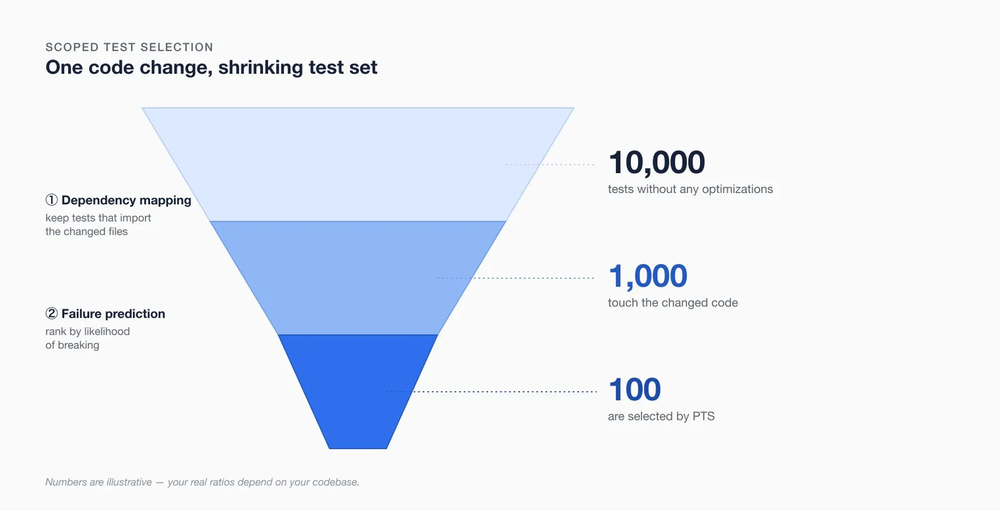
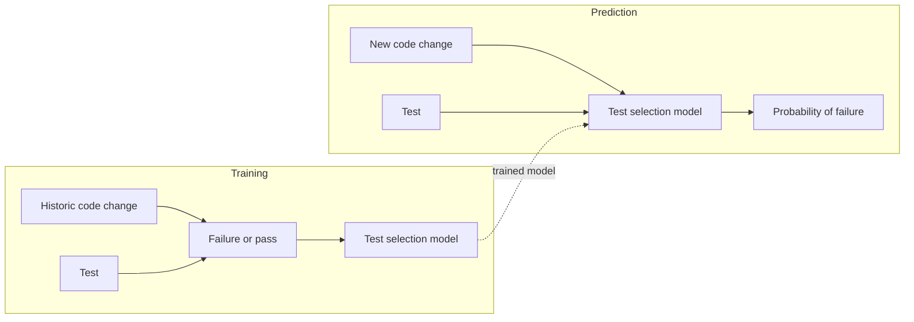
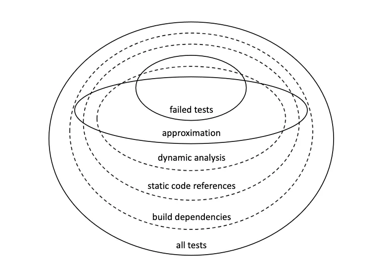

[In this Test Automation series](https://blog.theopnv.com/posts/2026/07/ci-speed-vs-quality/), we investigate ways to optimise code integration and delivery speed without trading off software quality. [In a previous article](https://blog.theopnv.com/posts/2026/07/blocking-vs-chasing-failures/) we explored the "when" to run tests during continuous integration. An equally important question to answer is "what" tests to run. 

What are some industry guidelines we could apply to a codebase with thousands or millions of tests?

## One line, thousands of tests
In a test setup that grew organically, without any optimizations, a developer edits one component file. The CI queues the whole test suite (let's imagine 10,000 tests). 

Each of these might only take a few milliseconds to run individually, but we're already talking about 10 minutes of CI run. It might not look like much, but that's enough for a developer to switch context and lose focus. Who never decided to go make themselves a coffee (quickly turning into a 30-minute break) while waiting for the test completion percentage to painfully reach 100%? Now multiply this by the number of developers in your team, and factor in a growing test corpus as your software matures.

Another insidious drawback of "mega" pipelines is that bundling every test behind one or a few triggers de-incentivizes code granularity and modularity when developing features.

This organic approach does not scale, so let's see how we can improve it.



## The low hanging fruit
[Change Impact Analysis](https://en.wikipedia.org/wiki/Change_impact_analysis) is the discipline of *"identifying the potential consequences of a change, or estimating what needs to be modified to accomplish a change"* (Bohner and Arnold). Basically: if we change this part of the app, what components or other pieces will break? What stakeholders will be impacted? 

While businesses mainly use it for project estimates, we can also apply it to find which tests need to run after a specific component was updated. Through dependency mapping ("this component is imported by this module", "this API route is used by this method"...), it becomes relatively easy to determine which subset of the software was changed, and thus which corresponding tests must run.

Or in [Meta's Engineering team's own terms](https://engineering.fb.com/2018/11/21/developer-tools/predictive-test-selection/): 
> "A common approach to regression testing is to use information extracted from build metadata to determine which tests to run on a particular code change. By analyzing build dependencies between units of code, one can determine all tests that transitively depend on sources modified in that code change."

Many test frameworks make this option available out of the box. For example [Jest](https://jestjs.io/docs/cli#--onlychanged) or [Playwright](https://playwright.dev/docs/test-cli) exposes some kind of `--only-changed` flag:

```javascript
// math.test.js

const { sum } = require('./math.js');

// With --onlyChanged, jest will only run this test if only sum changed (and if this is the only test importing sum)
test('adds 1 + 2 to equal 3', () => {
  expect(sum(1, 2)).toBe(3);
});
```

For many codebases, modular development (making sure components are scoped) and optimizing for short dependency chains are enough to reduce the number of tests run on each change by an order of magnitude. Our developer is now only running 1,000 tests, yay!  

For a company at the scale of Meta, however, even this approach resulted in too many tests (10^4) being run on simple changes.
## What's likely to break?
In [2018, Meta started investigating this problem](https://engineering.fb.com/2018/11/21/developer-tools/predictive-test-selection/). They postulated that it's impossible to know in advance and select the most minimal set of tests that would fail against a given change. As such, they didn't need to chase a perfect solution. They just needed a good enough one.

So they invested in Predictive Test Selection (PTS), powered by machine learning, to select a subset of tests to run when a PR lands. The rest run later, in a "stabilization" phase of the CI/CD pipeline, ensuring complete coverage.



Which features did the algorithm use to train itself?
- Is the code change a "hot" portion of the codebase? What is the number of files touched in the areas with the most churn?
- What's the size of the change? Larger changes are more likely to break tests.
- Who owns this code? Code changed by more contributors is likelier to break tests.
- How often a test was added when updating this part of the codebase? How did this part of the codebase evolve?
- How distant is the code from the tests? (Topology of the build dependencies)
- History and results of recent test runs.

There are some costs in maintaining such a system: developing the model, gathering historical test results, training the model against these, measuring efficiency and calibrating, deploying the model and continuously retraining it. That's why it should be considered only after hitting serious scale limitations.

Accounting for flaky tests is also needed to avoid polluting the training data. In their paper, Meta says they simply rerun any failing tests 10 times to eliminate any flakiness.

According to Meta, this technique reduced the total infrastructure cost of testing changes by a factor of two, while guaranteeing that over 95% of individual test failures and over 99.9% of faulty changes are still reported back to developers. And it's not only Meta: Microsoft uses a similar technique, described [in another paper from 2018](https://www.microsoft.com/en-us/research/wp-content/uploads/2018/12/PID5783051.pdf). They claim to save 18% of CI test time while retaining a test outcome accuracy of 99.99%. 

These are serious optimizations, further reducing the number of tests run on any changes by an extra order of magnitude. In our example, that's how we go from running 10,000 tests to scoping down to 100.
## But we didn't run the other 9,900 tests!?
That's right, and some bugs would possibly only surface by running them. Bugs a Predictive Test Selection model would otherwise miss.

For Meta, this optimisation trades correctness for latency: missed failures surface later, and rarely. [A PTS approach favors faster failure signal over thoroughness of quality verification](https://scontent-arn2-1.xx.fbcdn.net/v/t39.8562-6/240868806_224301516301760_8548155541470798663_n.pdf?_nc_cat=107&ccb=1-7&_nc_sid=e280be&_nc_ohc=De7cJWrfTOkQ7kNvwFYzJkK&_nc_oc=AdrI4aqwYmMZXPkVGUSojP_AVCUIUWgouK_A8-08jQQvO_pDOavD5gEZu5VFt4f-v18&_nc_zt=14&_nc_ht=scontent-arn2-1.xx&_nc_gid=IMzJ6d_eu-VRbMFzuqi4YA&_nc_ss=7b2a8&oh=00_AQDtoDZTsz7B-CWtRPkO251OD0id5Jsf3JoaxOHXl6Sa3g&oe=6A6CC9D7): 
> - Less thorough testing at diff - and land-time would cause developers to learn about errors that need to be corrected at a later time, in the extreme case at the stabilization phase. This increases the need to context-switch between tasks, which negatively impacts developer productivity.
> - More thorough testing prior to landing a diff, although reducing the chances of detectable bug being committed to master branch, negatively impacts the cost of testing and/or latency of correctness signal provided to a developer.


_Source: [Predictive Test Selection](https://scontent-arn2-1.xx.fbcdn.net/v/t39.8562-6/240868806_224301516301760_8548155541470798663_n.pdf?_nc_cat=107&ccb=1-7&_nc_sid=e280be&_nc_ohc=De7cJWrfTOkQ7kNvwFYzJkK&_nc_oc=AdrI4aqwYmMZXPkVGUSojP_AVCUIUWgouK_A8-08jQQvO_pDOavD5gEZu5VFt4f-v18&_nc_zt=14&_nc_ht=scontent-arn2-1.xx&_nc_gid=IMzJ6d_eu-VRbMFzuqi4YA&_nc_ss=7b2a8&oh=00_AQDtoDZTsz7B-CWtRPkO251OD0id5Jsf3JoaxOHXl6Sa3g&oe=6A6CC9D7), Meta_

The other 9,900 tests run in a later phase of code integration (at Meta, this is the "stabilization" phase), ensuring complete coverage before the software is released to customers.

An alternative setup is entirely possible [if early confidence in CI is too important](https://blog.theopnv.com/posts/2026/07/blocking-vs-chasing-failures/): keep running the entire test corpus, and use this model only to *reorder* it, running the tests most likely to fail first.
## Actionable items for every team
Implementing machine learning in any testing environment should only be done when hitting serious scale limitations. Most teams have other priorities to invest in first. It's still an interesting technique to be aware of, and some companies have even productized it into a commercially available solution (disclaimer: I've never used these):
- [Develocity (previously Gradle Technologies)](https://docs.develocity.ai/2026.2/using-develocity/predictive-test-selection/) 
- [Cloudbees (previously Launchable)](https://www.cloudbees.com/capabilities/cloudbees-smart-tests)

But there are more immediate action items for teams of any size:
- Turn on `--only-changed` flags in your test frameworks. This comes with extra benefits: 
	- Incentivizing code modularity. Developers will want to spend less testing time on their PRs and thus write smaller changes, which the DORA reports flag as [an important driver of software engineering velocity and efficiency](https://dora.dev/capabilities/working-in-small-batches/).
	- Enabling [sparse checkout clones](https://git-scm.com/docs/git-sparse-checkout) on the testing VMs, speeding up preparation times. Only the specific changes and corresponding tests need to be cloned on the VM instead of the whole repository.
- Make sure you regularly reassess the quality and relevance of your test corpus. This is something Google touches on in their [CI efficacy blog post](https://testing.googleblog.com/2018/09/efficacy-presubmit.html). A test that never fails is a useless test that consumes important resources and time. It should be removed.
- Good data is the prerequisite of any optimisation at scale: historical test and CI results, run frequency, and correlation with codebase changes.

I'm [Théo Penavaire](https://theopnv.com/), a senior CI/CD and Test Automation Engineer with more than 6 years of experience working with codebases at scale. If testing times are becoming a bottleneck for you, reach out and we'll figure out an optimisation strategy that works for your environment and constraints.

_The next part of this [test automation series](https://blog.theopnv.com/posts/2026/07/ci-speed-vs-quality/) will land soon. [Subscribe](https://blog.theopnv.com/newsletter/) if you’d like it in your inbox._
## Sources
- [Meta - Predictive Test Selection](https://research.facebook.com/publications/predictive-test-selection/)
- [Meta - Predictive test selection: A more efficient way to ensure reliability of code changes](https://engineering.fb.com/2018/11/21/developer-tools/predictive-test-selection/)
- [Launchable - What is Predictive Test Selection](https://medium.com/launchable/what-is-predictive-test-selection-4d718eba6ea1)
- [Launchable - Predictive Test Selection](https://www.launchableinc.com/eng/predictive-test-selection-efficient-software-test-execution/)
- [Wikipedia - Change Impact Analysis](https://en.wikipedia.org/wiki/Change_impact_analysis)
- [Tricentis - Change Impact Analysis](https://www.tricentis.com/learn/change-impact-assessment)
- [Microsoft - FastLane: Test Minimization for Rapidly Deployed Large-scale Online Services](https://www.microsoft.com/en-us/research/wp-content/uploads/2018/12/PID5783051.pdf)
- [Google - Taming Google-Scale Continuous Testing](https://static.googleusercontent.com/media/research.google.com/ja//pubs/archive/45861.pdf)
