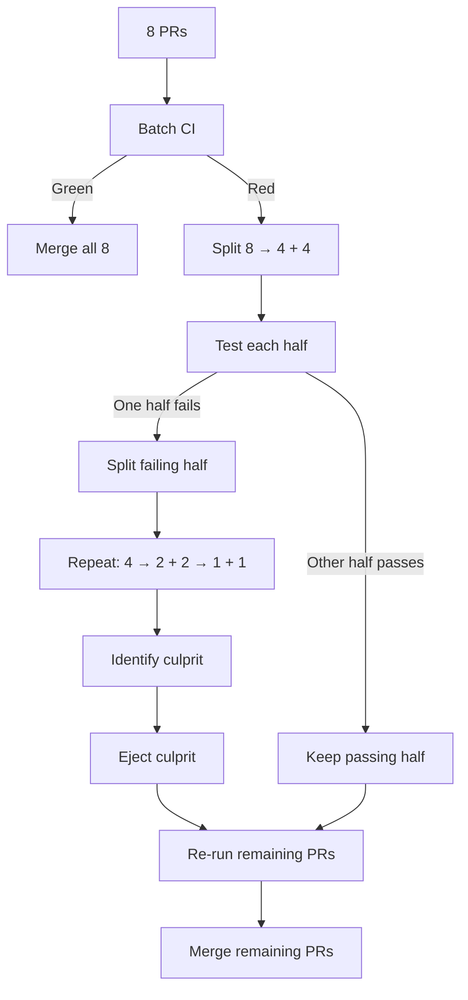

In [part 1 of this series](posts/2026/07/blocking-vs-chasing-failures/), we explored two strategies for delivering software: 
- One we called zero-gap: closing the gap between submission and testing early, at the cost of latency. 
- One we called "letting the gap trail": chasing failures and reverting them after submitting changes, at the cost of correctness.

We explored how the latter works at scale for huge companies like Google, but we did not explore how to scale when latency becomes too much of an issue with the former, zero-gap strategy. If your CI takes 30 minutes to run, the whole company can only merge roughly 16 PRs in an 8 hours working day.

Let's address that here, by presenting another tool in the test automation engineer's belt: the merge queue. 

## The not-rocket-science-rule
In the best scenario, you are gating the main branch by verifying the correctness of all changes by running robust tests. This is what Ben Elliston and Graydon Hoare (the creator of Rust) coined as the "Not Rocket Science Rule":

> Automatically maintain a repository of code that always passes all the tests.

It's a great idea on paper, and will work well in repositories where only one contributor is working on one Pull Request (PR) at a time. What happens when the team grows? We get merge skew.

## The risks of merge skew
Merge skew is defined as the number of commits ahead of the merge base of a code change. It's a gap growing as more code gets merged into the main branch from coworkers or agents. There are some risks with the gap growing too high:
- Merge conflicts we're all familiar with. Git, static type checkers and linters are excellent at detecting them.
- [Semantic conflicts](https://martinfowler.com/bliki/SemanticConflict.html). These don't break compilation but result in more subtle unintended behaviors or bugs at runtime.
- Of course both of these are not caught because of stale testing: the tests running on the branch don't reflect the latest state of the repository.

A simple technique to avoid a high merge skew is to require all PRs to rebase latest main and rerun the tests before landing. This keeps you compliant with the Not Rocket Science Rule.

But your team continues to grow. The issue becomes constantly having to rebase and rerun the tests manually because other PRs keep landing before yours is ready. This is where the concept of merge queues comes in.

## What makes a good merge queue?
At its core a merge queue is very simple: it's a way to automate the rebase of the latest state of the repository, and run tests against it. The concept was implemented somewhat publicly by bors in 2013. Basically all PRs are merged sequentially. This automates the work and makes engineers' lives easier, but does not significantly increase throughput.

Merge queues can however be sprinkled with many other features, for extra speed and efficiency gains.

### Transparency and Ecosystem integration as prime requirements
The non-negotiable of a good merge queue should be transparency to the whole engineering team, so that each developer understands where their PR stands in the queue, and when they can reasonably expect their changes to land. The configuration needs to be dynamic to allow fine tuning various parameters we will go through below.

Integration with an existing ecosystem and tools such as GitHub and Slack make for great developer experience.

### Batching
One of the biggest improvements a merge queue can bring is batching several PRs and landing them together instead of sequentially. Group -> test once -> if red, bisect to find the culprit -> eject -> re-run -> land the remaining. 



Here's some math to understand the savings economics:

Let each PR independently have a probability `p` of failing CI, and let `N` be a batch size (number of PRs).
- A green batch has a `(1-p)^N` probability of happening. It costs 1 run for N PRs.
- A red batch costs 1 initial run + roughly log₂(N) bisection runs to find the culprit (assuming a binary search approach)+ 1 final run to validate the remaining PRs.

So, under the simplifying assumption that a red batch contains one culprit, we can estimate:

```text
E[runs] ≈ 1 + [1 - (1-p)^N] × (log₂(N) + 1)
```
This is deliberately a simplified model: once batches frequently contain multiple failing PRs, isolating them becomes more complicated than a simple binary search.

How does it look in practice?

| p   | Expected Runs (N=8) | Expected Runs per PR | Cost reduction |
| --- | ------------------ | -------------------- | -------------- |
| 5%  | 2.35               | 0.29                 | 3.4x cheaper   |
| 20% | 4.33               | 0.54                 | 1.8x cheaper   |
| 50% | 4.98               | 0.62                 | 1.6x cheaper   |

The optimal batch size `N` should not necessarily be fixed. When the queue is empty or has only a few PRs waiting, it can make sense to run a smaller batch immediately rather than waiting to fill a larger one. When the queue is deep and the failure rate is low, larger batches can improve throughput. A good merge queue should therefore adapt its batch size to both queue depth and recent failure rates.

These numbers also give us a useful rule of thumb for `N`. If each PR has a probability `p` of being bad, the expected number of bad PRs in a batch is `N × p`. Keeping `N × p < 1` means we expect fewer than one bad PR per batch on average, which keeps the simple bisection strategy useful.

This is not an optimality rule: as `N` grows, batches containing multiple bad PRs become increasingly common and bisection becomes less efficient. If your failure rate is 5% (0.05), N = 20 is roughly the point where you expect one bad PR per batch on average. If it's closer to 20%, that point is N = 5.

Let's make clear that the batching technique is decreasing the time it takes to land `N` PRs (if `N > 1`), but except for fully green batches, it increases the time it takes to land a single PR. "Innocent" PRs will have to wait through more than 1 run if the batch is red. This is a tradeoff worth acknowledging.

It's also worth noting that flaky tests can heavily impact bisections, which we'll explore in a later article. Let's just say flaky tests increase the risk of confidently ejecting an innocent change if we don't rerun tests. So to avoid that we need to increase the number of runs, thus reducing the gains of batching. This is another case where treating flakiness as a reliability defect (not as a normal source of harmless retries) pays for itself. What's more, the merge queue orchestrator itself could quarantine flaky tests when they're found.

### Scoped and Parallel queues
Provided [the tests are scoped to the changes](posts/2026/07/scoping-tests/), it is possible to make the merge queue smarter by grouping PRs that only run the same tests together in the same batch. It would for example make sense to group all UI PRs together, or all documentation PRs. These queues can then run in parallel and different teams don't have to wait on the other tests before landing their changes.

This further reduces CI time since we don't need to run the entire set of tests (also reducing the flakiness risks). Parallel queues are only safe when changes across queues are known to be independent, or when a final integration check validates the combined state before landing.

### Manual or Automated prioritization and control
This one is pretty simple. The merge queue orchestrator should give engineers the ability to prioritize and put hotfixes in front of the queue, ahead of new features.

It could be useful to also provide the merge queue with the ability to guide bisections in case of failures (when the culprit PR is relatively obvious), or to allow AI to do it (analyzing the changes from each PR).

### Speculative checks
Uber's [SubmitQueue](https://github.com/uber/submitqueue) forbids PRs with *merge* conflicts from even entering the queue in the first place. Then it runs "speculative checks": instead of testing changes in the order they arrive (or in batches), the queue tests a change against multiple possible futures at once. For example, "what if the change ahead of me succeeds", and "what if it fails". When the real outcome resolves, the answer for the next change is already sitting there ready and can land immediately. 

It's like a chess engine that, instead of waiting for its opponent to move, calculates its best response to every plausible opponent move in advance.

Speculative checks buy lower latency, at the cost of extra compute. Some tests run on builds that will sometimes be thrown away (Uber quotes 40-65% of builds can be prematurely terminated).

This feature clearly increases the complexity of a merge queue so only mature teams with a lot of compute available should implement it.

## So should you use a merge queue?
This is a proven and mature technique to pair with the zero-gap strategy. Using a merge queue improved wait time for code to land by [33% at GitHub](https://github.blog/engineering/engineering-principles/how-github-uses-merge-queue-to-ship-hundreds-of-changes-every-day/). What are the tradeoffs?

### Increased complexity
While the core principle of landing changes sequentially is simple, a merge queue system can quickly grow into a critical and complex piece of your infrastructure with many features and a whole set of behaviors that engineers must understand and will sometimes try to game. 

There are many tradeoffs to consider when configuring a merge queue (batch size, trigger conditions, bisection configuration...), and each of them costs engineering time and resources.

### Death spiral
Above some failure rate, batching reduces throughput. Batches never go green, bisections take forever and the queue grows faster than it can land changes. This is where reducing the batch size can help bisections go quicker (the `N < 1/p` heuristic). But reducing the failure rate should ultimately be the goal (more robust review processes, pre-submit tests, ...)

### Normalized escape hatches erode confidence
If the queue provides features like prioritization of PRs and emergency merge buttons, there is a risk that using them becomes normalized after a while, eroding other engineers' confidence in the queue.

### Merge queues also need cultural changes
The engineering team needs to buy into this new delivery system. It needs to enforce a blameless revert culture as some PRs get ejected after they are written, done and the author already moved to something else. It's even truer for innocent PRs that get ejected because of flaky tests. There likely needs to be a guardian team or some monitoring over the merge queue to ensure good throughput, as well as collect various measurements we'll discuss below. This too is extra engineering time and resources. 

That said, the benefits of setting up a merge queue considerably outweigh the drawbacks. I would advise starting simple and using more advanced features when the team grows more mature and hits limitations over time.

And it goes without saying: use a merge queue when the PR arrival rate approaches the service capacity, not simply because CI is slow. If your daily PR volume is far below the serial ceiling presented in the first sections (e.g. 16 PRs a day), the benefits of a merge queue don't justify the costs, and rebase-before-merge is sufficient. 

### What to measure?
Measurements can both inform the decision to switch to a merge queue, and once the switch is done, the decisions on how to configure it as the codebase grows:
- Attributes of the environment: number of contributors, number of PRs per contributor, per day...
- PR arrival rate
- Wait time for developers to land changes (p50, p95)

(When a merge queue is in place):

- Batch failure rate: small batches make sense when the rate is high, because the bisections will be quicker. A low failure rate opens up the door to bigger batches (the `N < 1/p` heuristic)
- Mean bisection depth
- Ejection rate and innocent ejection rate (a proxy for flakiness contamination)
- Subjective engineering team feelings about velocity and confidence in the system (through surveys...)

## Build or buy?
If you're convinced you need a merge queue, you have several options.

First, many companies developed their own solutions internally:
- The Rust team developed [bors](https://github.com/graydon/bors) in 2013
- Strava developed [Butler](https://medium.com/strava-engineering/butler-merge-queue-how-strava-merges-code-7095a3310930) in 2017
- Uber developed its [SubmitQueue](https://github.com/uber/submitqueue) around 2017 too
- Airbnb developed [Pipeline](https://medium.com/airbnb-engineering/introducing-deploy-pipelines-to-airbnb-fc804ac2a157) in 2018
- And Shopify developed [Shipit](https://shopify.engineering/introducing-the-merge-queue) in 2018

But developing a merge queue system is almost an entire engineering domain of its own! Fortunately we're well into the mature era of commoditized merge queue systems, so you can find off-the-shelf, ready-to-use solutions:
- [GitHub Merge Queue](https://github.blog/news-insights/product-news/github-merge-queue-is-generally-available/)
- [GitLab Merge Train](https://docs.gitlab.com/ci/pipelines/merge_trains/)
- [Mergify](https://mergify.com/)
- [Aviator](https://www.aviator.co/merge-queue)
- [Trunk.io](https://trunk.io/merge-queue)
- [Graphite](https://graphite.com/features#merge-queue)

And even open-source ones:
- [Kodiak](https://github.com/chdsbd/kodiak)
- [Bulldozer](https://github.com/palantir/bulldozer)
- [SubmitQueue](https://github.com/uber/submitqueue) is on GitHub

I want to take a moment to credit the Mergify, Trunk.io and Graphite engineering blogs, full of well-written insight. It was immensely useful for writing this intro about what makes a state of the art merge queue in 2026. I would encourage anyone interested in more information to visit these.

However, I have not used any of the solutions I listed, nor am I affiliated with any of them. There are probably many others to try out there.

## Closing the loop
A merge queue increases both correctness and throughput, which was the premise of this series. For the sake of the exercise, let's estimate how many PRs we could hope to land with a merge queue, remembering that we started from about 16 per day without. This is a deliberately simplistic throughput model:

```text
slots = 8h ÷ 30min = 16
probability a batch is red = P(red) ≈ 1 - (1 - p)^N
expected runs per batch = E[runs] ≈ 1 + P(red) × (log₂(N) + 1)
merges/day ≈ slots × N / E[runs]

``` 

Which gives:

| p   | N  | Expected runs per batch | Illustrative merges per day |
| --- | -- | ----------------------- | --------------------------- |
| 5%  | 20 | 4.4                     | ~73                         |
| 20% | 5  | 3.2                     | ~25                         |

These numbers should not be treated as production capacity forecasts. The model deliberately ignores several real-world effects such as batches containing multiple failing PRs, queue fill time, variable CI durations and flaky tests. On the ceiling side, many possible optimizations such as parallel queues, speculative checks, prioritization... could further improve these numbers, but were left aside. Its value is mainly to illustrate the shape of the tradeoff.

With a failure rate of 5%, the model suggests that batching could increase theoretical capacity from 16 to roughly 73 PRs per day. With a failure rate of 20%, the benefit is much smaller, at roughly 25 PRs per day.

The part I find interesting is that the constraint has moved and becomes actionable. It is no longer CI duration alone. Failure and flakiness rates become part of the capacity equation. A higher failure rate both limits how aggressively you can batch and consumes additional CI capacity recovering from failed batches. That's why reducing failures and flakiness can have a disproportionate effect on throughput.

This is a powerful incentive for improving these rates, because the same engineering work can improve both velocity and confidence. 

And don't forget that other strategies exist, which we discussed in part 1. Here's a recap of all the techniques we've seen.

|                   | Zero gap                       | Trailing gap                 | 
| ------------------| ------------------------------ | ---------------------------- |
| Naive version     | Rebase + run everything per PR | Land, hope                   |
| Scaling mechanism | Merge queue                    | Culprit finder + auto revert |
| Example           | Uber SubmitQueue, GitHub       | Google                       |

Whatever the strategy choice (or blend), you are now armed with many techniques to improve your test automation setup!

I'm [Théo Penavaire](https://theopnv.com/), a senior CI/CD and Test Automation Engineer with more than 6 years of experience working with codebases at scale. If testing times are becoming a bottleneck for you, reach out and we'll figure out an optimisation strategy that works for your environment and constraints.

## Sources
- [Mergify - What is a merge queue?](https://mergify.com/learn/merge-queue)
- [Mergify blog - The origin story of merge queues](https://mergify.com/blog/the-origin-story-of-merge-queues)
- [Graphite blog - Bors, Google, and the tap merge queue](https://graphite.com/blog/bors-google-tap-merge-queue)
- [Trunk.io blog - Outgrowing GitHub Merge Queue](https://trunk.io/blog/outgrowing-github-merge-queue)
- [Ingredients of a Scalable Merge Queue | Merge Queue 101 (YouTube)](https://www.youtube.com/watch?v=V74t41-uV7I)
- [Uber Engineering blog - Slashing CI costs at Uber](https://www.uber.com/fr/en/blog/slashing-ci-costs-at-uber/)
- [Masoud Saeida Ardekani et al. - SubmitQueue paper, EuroSys '19](https://www.masoud.io/docs/eurosys19.pdf)
- [Boosting GitHub Actions efficiency with merge queue (Medium)](https://medium.com/@tbrovy/boosting-github-actions-efficiency-with-merge-queue-69377551271c)
