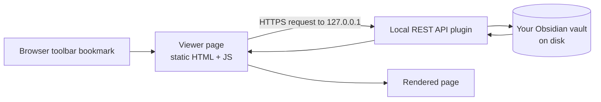

I keep my bookmarks in Obsidian. Not in the browser's bookmark manager, not in a read-later app: a plain markdown note, grouped by theme, that I can add to/remove from anytime.

It's a good system, except for the last mile. Every time I want to open one of those links, I have to leave the browser, find the Obsidian window, find the note, click the link, and land back in the browser. Five seconds and a context switch, several times a day, for something the browser should have been able to show me directly.

The obvious fixes didn't fit: 
- [Obsidian Publish](https://obsidian.md/publish) is paid (and this is absolutely fair). 
- A static site generator like Hugo, Jekyll... means a build step every time I add a line. 
- Copying everything into Notion (which does have a free publish feature) means maintaining the same list twice. 
- And keeping Obsidian permanently open in a second window is just moving the problem around.

So I built a small thing! [obsidian-page-to-browser](https://github.com/theopnv/obsidian-page-to-browser). It turns any note in your vault into a live local webpage that you can pin to your browser toolbar.

## What it actually is

It's a single static page. You open it with a `?file=` parameter pointing at a note in your vault, and it renders that note as a clean, styled HTML page:

```
https://<your-viewer-url>/?file=Resources%2FBookmarks%2FBookmarks.md
```

Bookmark that URL, drag it to your toolbar, and your bookmarks note is one click away. Edit the note in Obsidian, refresh the tab, and the change is there. No build, no publish, no sync.

The trick is that the page doesn't host anything itself. It talks to the [Local REST API](https://github.com/coddingtonbear/obsidian-local-rest-api) community plugin, which serves your vault over HTTPS on `127.0.0.1`. The viewer is just a renderer sitting in front of it.



Because the API only listens on localhost, nothing leaves your machine. The viewer page can be the hosted copy on GitHub Pages or your own fork. Either way it's static assets, and the note content never travels further than your own browser.

## What I use it for

The bookmarks note was the starting point, but the pattern generalises to anything you want to *read* often and *edit* rarely:

- **Bookmarks and reading lists.** The original itch. Grouped by topic, with notes, updated from Obsidian, read from the toolbar.
- **Todo lists.** Markdown task lists render as checkboxes. Not interactive (you tick them in Obsidian), but perfectly readable when you just want to see what's left.
- **Cheatsheets.** Code blocks come out with syntax highlighting.
- **Maps of content.** Wikilinks work, so a hub note becomes a navigable little site: clicking `[[Another Note]]` loads it in place, no page reload.
- **Project dashboards.** Links, current status... One tab, always current.

The common thread is that these are all things you consult *while doing something else in the browser*. That's the whole reason the last mile mattered in the first place.

## What it doesn't do

It'll save you a download if it's a dealbreaker. I deliberately wanted to stay opinionated and small:

- **No callouts, embeds, tags or frontmatter rendering.** It handles standard markdown (headings, lists, tables, task lists, code blocks, links, wikilinks and aliased wikilinks) and stops there. If your notes lean heavily on Obsidian-specific syntax, they'll look plainer than they do in the app.
- **No mobile access.** The Local REST API listens on `127.0.0.1` only. Your phone can't reach it, and making it reachable would mean exposing your vault to the network, which is precisely the thing this avoids.
- **Obsidian has to be running.** The plugin is the server. Close the app, and the page has nothing to talk to.
- **It's a viewer, not an editor.** Editing stays in Obsidian.

But if there's anything you'd like to support, open an issue or pull request on github and we can discuss it.

## On building small tools now

I should mention how this got made: most of it was written with an AI agent, over an evening. That's relevant less as a novelty than as an observation about what's worth building.

This tool solves a problem for approximately one person. Before, the honest cost-benefit on a weekend project like this: read the Local REST API docs, wire up the markdown rendering, handle the certificate dance — landed on "just keep the extra window open." Now the calculation is different, and a lot of small, specific, slightly annoying problems have crossed the line into being worth fixing properly.

## If you want to try it

The repo is at [github.com/theopnv/obsidian-page-to-browser](https://github.com/theopnv/obsidian-page-to-browser), with the setup steps and a hosted viewer you can point at your own vault. Issues and PRs are welcome, particularly around the markdown features it doesn't cover yet.

And if you've solved the same problem a different way, I'd love to hear it.
