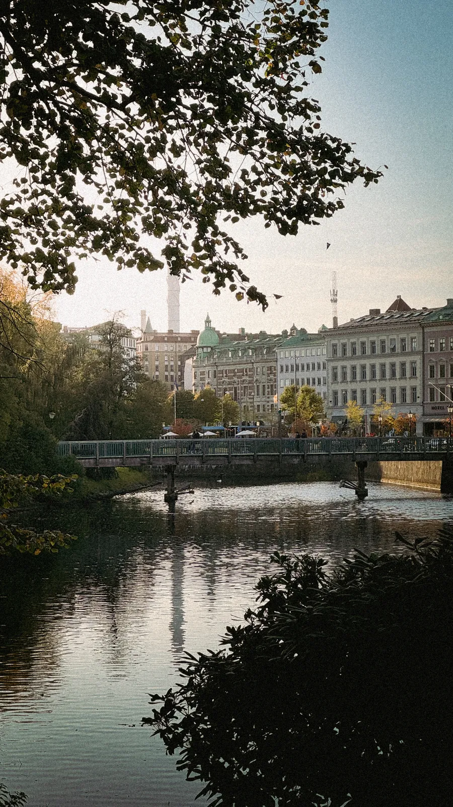
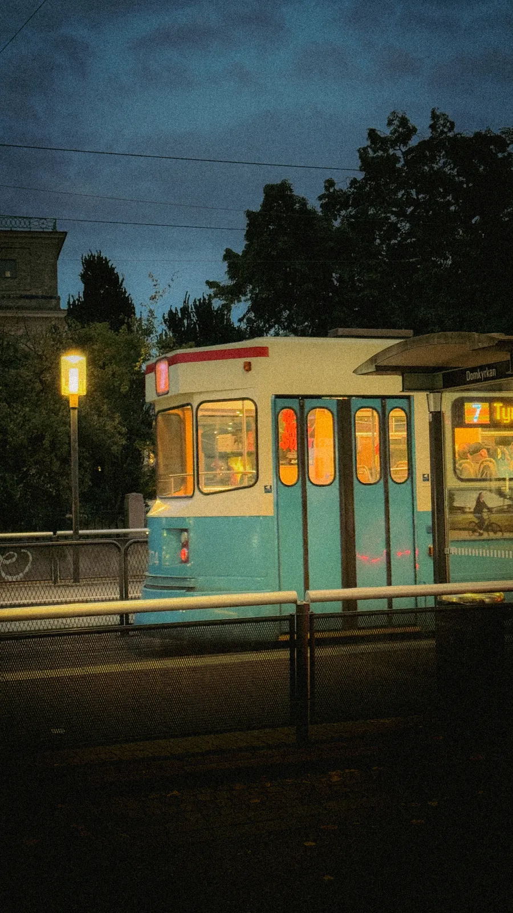
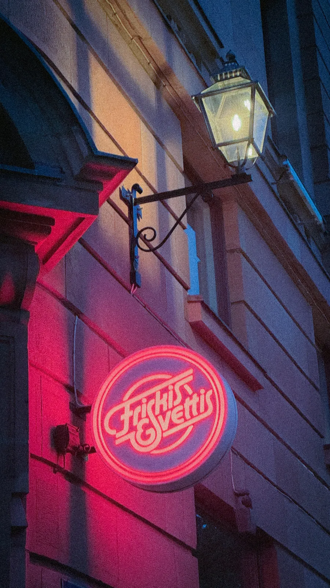

## Take your time
Arguably this could have been reduced to 2 days. But that's my first advice: don't take the train to cover such great distances for the sake of just taking the train, use it to stop along the way and discover off-the-path places you haven't been to yet. I stopped in Copenhagen 🇩🇰 to visit some friends, and the next day in Gothenburg 🇸🇪 which I never visited before. 





Virtually extending the journey also allows for having enough buffer between each leg of the trip. You want to have at least 2 hours between international train rides. These usually take longer than planned because the trains are not high speed, and they sometimes stop at the border (yes, even inside the Schengen area) for random checks. I recommend bumping that margin to 3 hours for German 🇩🇪 connections, because of the notoriously terrible railway infrastructure there. My sleeper train to Hamburg had a 2 hours delay, and the one after was canceled randomly. 



The Deutsche Bahn app at least provided live updates on the delays and alternatives, so I'd recommend having it ready if your trip involves going from/to/through Germany.

## 404 not found: unified platform and efficient infrastructure
That's something I found lacking: a (good) unified interface for all railway companies across Europe. I still needed to purchase individual tickets, across 5 national companies. I'm not sure I could have claimed a refund if a delay made me miss the next connection. Good thing I didn't have to test this part of the system.

A website that did help tremendously was [Hurrail](https://www.hourrail.voyage/en): I could plan different routes, layovers, durations, and it redirected me to the individual railway websites for the booking. There's also a social aspect with user reviews about routes and stations: exactly what one needs when comparing alternatives.

It's a good prototype for what the [European Commission unveiled in May 2026](https://france.representation.ec.europa.eu/informations-et-evenements/informations/voyages-en-train-en-europe-la-commission-propose-un-billet-unique-et-des-droits-renforces-pour-les-2026-05-18_fr?prefLang=en): a system to ease the booking through a unique ticketing system, and to reinforce travelers rights consistently across the continent. But it's only a plan for now and it will likely take a (too) long time before implementation.

The digital side is only half of the improvements we need. Renewed focus on maintenance and infrastructure is also underway. The [Fehmarn Belt tunnel between Hamburg and Copenhagen in 2031](https://en.wikipedia.org/wiki/Fehmarn_Belt_fixed_link), the [Turin-Lyon tunnel in 2033](https://en.wikipedia.org/wiki/Turin%E2%80%93Lyon_high-speed_railway), [Rail Baltica in 2034](https://en.wikipedia.org/wiki/Rail_Baltica) should all help with the network load and scalability. Stay tuned for the 2035 update of this article!

## Why did I even do that..?
Some friends and family thought it was a joke when I told them I'm going from France to Norway by train. Some asked if I inflicted this to myself to combat climate change. 

The point is that this journey was not "painful": it is entirely possible to take it on and to enjoy it already. I didn't have any issues, granted, with a lot of margin during connections, and the overall trip was the same price as a plane ticket. 
And 2026 is a baseline. Train trips across Europe will only get better within a few years, with all the improvements mentioned above. So we should collectively normalize taking the train for long distances.

You do not have to be a climate change activist to travel by train. Yes, I used 70% less CO2 emissions than if I took the plane for this trip. But along the way, I got to enjoy beautiful views (Norwegian mountains!...), read, learn, work (all in all, live my regular life), and I got to know my neighbors better. There's hardly a better way to realize Europe is so dense culturally and geographically than to depart from one capital and arrive in another within a few hours, without leaving the ground. Or to speak 3 different languages in the same day. In the wake of the populism wave in France, Germany, the UK and many other places, I'd go as far as saying every European citizen should go at least once in their lives on such a (not so expensive) trip. We're all in this together and self-centered nationalist policies won't cut it.

And let's admit it: what's more romantic than trains? Not all trips should be optimized for speed. Sometimes leaning against the window with inspirational music on, I had time to reflect back on the last few months and to transition into a new life chapter. 



## Tips, awards and random thoughts

- The best trains in Europe are... Swedish! Clean, spacious, good internet and one was even 5 minutes early on a 3 hours leg. 
- A *journey* booking in Germany does not guarantee you a *seat* (wtf?). Remember to book both separately. If you don't, cross fingers for enough free seats remaining, or expect to stand in the alley by your luggage.
- Pay attention to long connections arriving and departing from different stations in the same city. Twice I had to take a train/tram for a few minutes to connect between 2 big stations. It can be an additional stress source if unplanned.
- Do not be cheap like me: ALWAYS book a bed in a sleeper train, not a seat. At least if you plan on sleeping...


