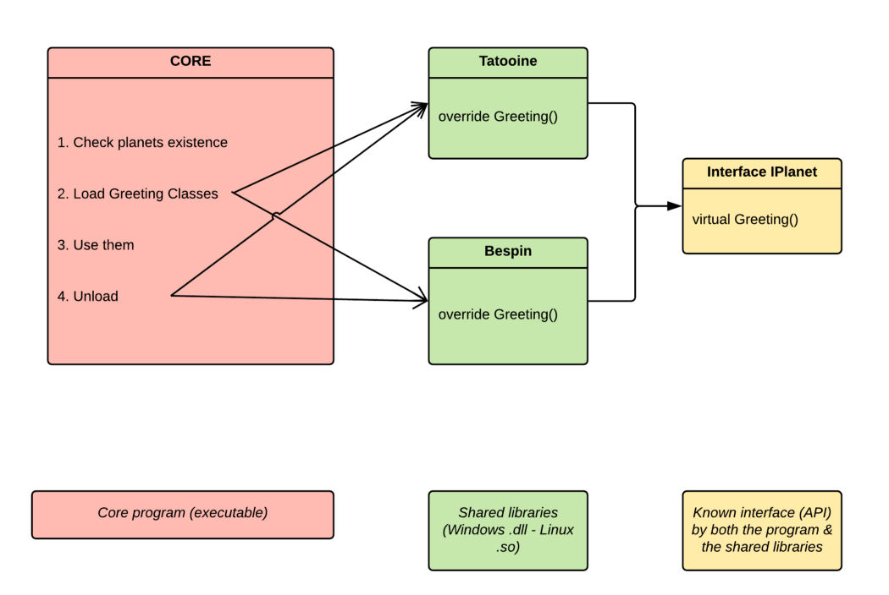
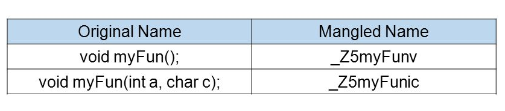
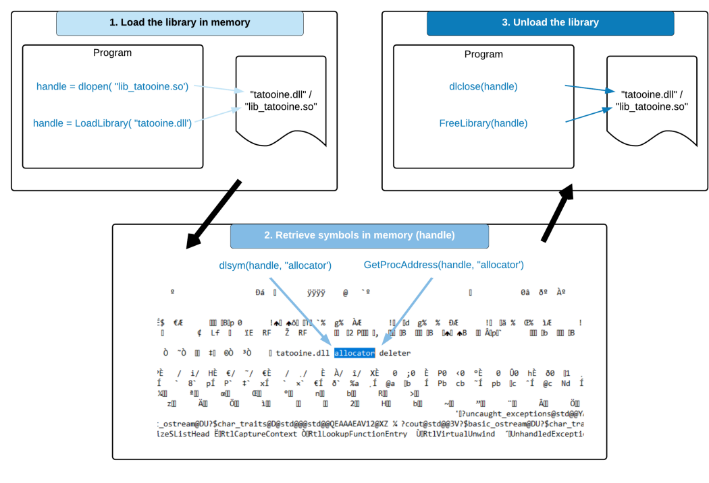

To go to the Github repository, [click here](https://github.com/theo-pnv/Dynamic-Loading).

There is already a lot of stuff on internet, related to dynamic loading of classes from a shared library. However I couldn’t find a simple example and explanation on how to do it with the following conditions :

- **Modern C++** (from c++11): Use of smart pointers to store the classes retrieved from the libraries
- **Cross-platform**: Works on UNIX (tested on Linux & MacOS) and Windows.
- **Generic** enough to be used by a wide range of programs.

## Introduction

One of the best ways to make a C++ program accept plugins is to use dynamic loading of a class from a library. According to [Wikipedia](https://en.wikipedia.org/wiki/Dynamic_loading), dynamic loading is the process that allows to retrieve functions and variables from a library. It’s very powerful, for multiple reasons:

- It requires **no restart** when you “load” or “unload” a shared library from an executable, because it isn’t statically linked.
- The library’s content is not included in the binary, and therefore the developer **doesn’t have to compile it each time** (s)he wants to update the binary.
- The developer is able to push further the **separation of concerns**, and to improve the overall **reusability of the components**.

Imagine programming an HTTP server, for example. It must ideally have several modules, with different goals for each one (SSL, PHP…). Instead of including all of them in one binary, why not making them shared libraries and load them with dynamic loading?

In this article, I’ll do my best to explain and show you a simple method to load classes from shared libraries, taking care of the conditions listed above.

## What we’ll be building

A simple C++ program, running both on UNIX and Windows. It will have a Core part (the executable), responsible for checking the libraries existence, and then to load, use and unload them. The libraries are classes that greet the user from the different Star Wars planets. They share a common interface, `IPlanet`, which is also known by the Core.

Here is a basic diagram to show how it works:



Note that my goal is to show a simple implementation of all of this, therefore adding error handling and/or some optimizations might be good once you get the concept.

Let’s get started!

## The interface (API)

All the classes coming from the shared libraries will inherit from this interface. Having an interface is useful when you have multiple libraries, because the core won’t know every concrete class. The core is then able to manipulate each class through the interface.

```cpp
#pragma once

class IPlanet
{
public:
	virtual ~IPlanet() = default;

	virtual void greet() = 0;
};
```

Both the core AND the libraries must be aware of this class. Therefore it can be useful to keep it in a separated file and folder.

## The shared libraries

A long time ago, in a galaxy far, far away… Was Tatooine. The Tatooine header, in its simpliest form, is as follow :

```cpp
#pragma once

#include <iostream>
#include "IPlanet.h"

class Tatooine : public IPlanet
{
public:
	Tatooine() = default;
	~Tatooine() = default;

	void greet() override;
};
```

There’s not a lot of things to say about it, the interesting part is in its .cpp

```cpp
#include "Tatooine.h"

#if defined(__linux__) || defined(__APPLE__)
extern "C"
{
	Tatooine *allocator()
	{
		return new Tatooine();
	}

	void deleter(Tatooine *ptr)
	{
		delete ptr;
	}
}
#endif

#ifdef WIN32
extern "C"
{
	__declspec (dllexport) Tatooine *allocator()
	{
		return new Tatooine();
	}

	__declspec (dllexport) void deleter(Tatooine *ptr)
	{
		delete ptr;
	}
}
#endif

void Tatooine::greet()
{
	std::cout << "Greetings from Tatooine !" << std::endl;
```

A few things here:

- We use a **conditional preprocessor macro** : `#ifdef` to only enter the condition if we are compiling on a specific platform. Here it may be Windows (`WIN32`), MacOS (`__APPLE__`), or Linux (`__linux__`). We can’t exactly use the same code for both platforms because of the next point.
- For Windows we have to include `__declspec (dllexport)` before the function prototype. More info on this [here](https://msdn.microsoft.com/en-us/library/a90k134d.aspx).
- There is this `extern "C"` line, **wrapping some C**-like functions. It is in this part that we will set our entry points to load and unload the library class right into and from our “core” program. To know why we need it, we must understand how dynamic loading works.

### Note on the dynamic loading process

To load something from a shared library, we need to know where to look at in the assembly file. That’s where symbols are useful. Symbols can be anything, like a function, a variable and, in our example, classes (remember Tatooine ?). As long as we know the name of the symbol we need, we can use a set of low-level functions : `dlopen()`, `dlsym()` and `dlclose()` for UNIX, `LoadLibrary()`, `GetProcAdress()` and `FreeLibrary()` for Windows. These functions allow us to load the shared library into the memory, then to retrieve the symbol, to get the class from it and to unload the library.

All of this could work in C for example, where there is no (or little) “[name mangling](https://en.wikipedia.org/wiki/Name_mangling)“. As said by Wikipedia, name mangling is the modification of variables names into the assembly file. It is required in languages implementing features like parametric polymorphism, templates, or namespaces. Like in C++!

Indeed, if several functions share the same name but with different signatures, the compiler must clearly differenciate them in the final assembly. Mangling is made by the compiler.



By wrapping our “entry code” with `extern "C"`, we make sure that no name mangling will be done by the compiler. The symbols in the assembly file will be exactly the same as the ones in our source code. We’ll be able to retrieve them more easily, simply using their names.

So there are two entry points (symbols) for our class : `allocator` and `deleter`.

### Allocator

We will get an instance of the library class through it. However we can’t return a smart pointer because it isn’t valid C. We just return a C pointer, and we’ll turn it into a smart one on the dlloader-side.

### Deleter

This one will be called when we’ll need to destroy our class. [It is important](https://stackoverflow.com/questions/1605640/using-shared-ptr-in-dll-interfaces/1605833#1605833) to have a destructor directly in the dynamic library, to ensure that the memory management will happen in it.

That’s about it for the libraries. I just included one library here, but the principle remains the same for any other one, as long as it implements the `IPlanet` interface.

## The Dynamic Library Loader (DLLoader)

Hold on, this is quite a long tutorial, but it's worth it (I hope)! Now is another interesting part: the dynamic library loader, which is included in the core (the executable).

First, let’s resume the process. Here are the steps we need to have it working smoothly:



### Sidenote about the compilation

Remember that our code must run on UNIX as well as on Windows. We will use the same concept of separated compilation with OS macros, but in the `CMakeLists` this time.

```cmake
if (WIN32)
set(DLLOADER_SRC Core/DLLoader/Windows/DLLoader.h)
include_directories(Core/DLLoader/Windows/)
endif(WIN32)

if(UNIX)
set(DLLOADER_SRC Core/DLLoader/Unix/DLLoader.h)
include_directories(Core/DLLoader/Unix/)
endif(UNIX)
```

We need two different source files, because the code to interact with shared libraries is very low level and OS-specific. One for UNIX, and one for Windows. Here though, they won’t be .cpp files, but .h files. It will be easier to put everything in the header because the class is templated.

Firstly we need to create an interface for the DLLoader. Both Linux’s concrete DLLoader and Windows’ one will inherit from it.

### The IDDLoader interface

```cpp
#pragma once

#include <memory>
#include <string>

namespace dlloader
{
	template
	class IDLLoader
	{
	public:
		virtual ~IDLLoader() = default;

		/*
		** Load the library and map it in memory.
		*/
		virtual void DLOpenLib() = 0;

		/*
		** Return a shared pointer on an instance of class loaded through
		** a dynamic library.
		*/
		virtual std::shared_ptr	DLGetInstance() = 0;

		/*
		** Unload the library.
		*/
		virtual void DLCloseLib() = 0;
	};
}
```

I believe the comments in the code are sufficient.

### Linux's DLLoader class

```cpp
#pragma once

#include <iostream>
#include <dlfcn.h>
#include "IDLLoader.h"

namespace dlloader
{
	template
	class DLLoader : public IDLLoader
	{
	private:
		void			*_handle;
		std::string		_pathToLib;
		std::string		_allocClassSymbol;
		std::string		_deleteClassSymbol;

	public:
		DLLoader(std::string const &pathToLib,
			std::string const &allocClassSymbol = "allocator",
			std::string const &deleteClassSymbol = "deleter") :
			  _handle(nullptr), _pathToLib(pathToLib),
			  _allocClassSymbol(allocClassSymbol),
        _deleteClassSymbol(deleteClassSymbol)
		{
		}

		~DLLoader() = default;

		void DLOpenLib()
		{
			if (!(_handle = dlopen(_pathToLib.c_str(), RTLD_NOW | RTLD_LAZY))) {
				std::cerr << dlerror() << std::endl;
			}
		}

		void DLCloseLib() override
		{
			if (dlclose(_handle) != 0) {
				std::cerr << dlerror() << std::endl;
			}
		}
	};
}
```

As said before, we need a handle to store the shared library in memory once it is loaded from its file. We also need two symbol holders : `allocClassSymbol` and `deleteClassSymbol`.

The `DLOpenLib()` function is quite simple, it is calling [dlopen()](https://linux.die.net/man/3/dlopen) to load the library in memory. The `DLCloseLib()` function is calling [dlclose()](https://linux.die.net/man/3/dlopen) to unload it.

The interesting stuff is below :

```cpp
std::shared_ptr DLGetInstance() override
{
	using allocClass = T *(*)();
	using deleteClass = void (*)(T *);

	auto allocFunc = reinterpret_cast(
			dlsym(_handle, _allocClassSymbol.c_str()));
	auto deleteFunc = reinterpret_cast(
			dlsym(_handle, _deleteClassSymbol.c_str()));

	if (!allocFunc || !deleteFunc) {
		DLCloseLib();
		std::cerr << dlerror() << std::endl;
	}

	return std::shared_ptr(
			allocFunc(),
			[deleteFunc](T *p){ deleteFunc(p); });
}
```

We use the return of `dlsym()` to get each symbol we need.
This variable is then casted to a function pointer, to make it usable.

So we have:

- Allocator entry point: function pointer of type `allocClass` & held by the variable `allocFunc`.
- Deleter entry point: function pointer of type `deleteClass` & held by the variable `deleteFunc`.

Finally, remember that we wanted to use smart pointers? With C++11 we should limit our usage of raw pointers. That’s why we build it directly in this function, with the allocator and the deleter. [Take a look](http://en.cppreference.com/w/cpp/memory/shared_ptr/shared_ptr) at the overloads of std::shared_ptr’s constructor. Note that we call the deleter through a lambda, to pass it the raw pointer that we have to delete.

### Windows' DLLoader class

That’s basically the same principle. System calls are not the same though, so don’t forget to change them. Here is the entire source code for this class.

```cpp
#pragma once

#include <iostream>
#include "Windows.h"
#include "IDLLoader.h"

namespace dlloader
{
	template
	class DLLoader : public IDLLoader
	{
	private:
		HMODULE			_handle;
		std::string		_pathToLib;
		std::string		_allocClassSymbol;
		std::string		_deleteClassSymbol;

	public:
		DLLoader(std::string const &pathToLib,
			std::string const &allocClassSymbol = "allocator",
			std::string const &deleteClassSymbol = "deleter") :
			_handle(nullptr), _pathToLib(pathToLib),
			_allocClassSymbol(allocClassSymbol), _deleteClassSymbol(deleteClassSymbol)
		{}

		~DLLoader() = default;

		void DLOpenLib() override
		{
			if (!(_handle = LoadLibrary(_pathToLib.c_str()))) {
				std::cerr << "Can't open and load " << _pathToLib << std::endl;
			}
		}

		std::shared_ptr DLGetInstance() override
		{
			using allocClass = T * (*)();
			using deleteClass = void(*)(T *);

			auto allocFunc = reinterpret_cast(
				GetProcAddress(_handle, _allocClassSymbol.c_str()));
			auto deleteFunc = reinterpret_cast(
				GetProcAddress(_handle, _deleteClassSymbol.c_str()));

			if (!allocFunc || !deleteFunc) {
				DLCloseLib();
				std::cerr << "Can't find allocator or deleter symbol in " << _pathToLib << std::endl;
			}

			return std::shared_ptr(
				allocFunc(),
				[deleteFunc](T *p) { deleteFunc(p); });
		}

		void DLCloseLib() override
		{
			if (FreeLibrary(_handle) == 0) {
				std::cerr << "Can't close " << _pathToLib << std::endl;
			}
		}
	};
}
```

The last part we need is the core, to link all of this !

## The Core

```cpp
#include <iostream>
#include <string>
#include <memory>
#include "DLLoader.h"
#include "IPlanet.h"

using namespace std;

#ifdef WIN32
static const std::string bespinLibPath = "Bespin.dll";
static const std::string tatooineLibPath = "Tatooine.dll";
#endif
#ifdef __linux__
static const std::string bespinLibPath = "./libBespin.so";
static const std::string tatooineLibPath = "./libTatooine.so";
#endif
#ifdef __APPLE__
static const std::string bespinLibPath = "./libBespin.dylib";
static const std::string tatooineLibPath = "./libTatooine.dylib";
#endif
```

For the sake of the example, the shared libraries paths are hard-coded. Don’t forget to compile the libraries individually, and put them in the executable’s folder.

```cpp
void greetFromPlanet(dlloader::DLLoader& dlloader)
{
	std::shared_ptr<IPlanet> planet = dlloader.DLGetInstance();

	planet->greet();
}

void greet(const std::string& path)
{
	dlloader::DLLoader dlloader(path);

	std::cout << "Loading " << path << std::endl;
	dlloader.DLOpenLib();

	greetFromPlanet(dlloader);

	std::cout << "Unloading " << path << std::endl;
	dlloader.DLCloseLib();
}

int main()
{
	greet(tatooineLibPath);
	greet(bespinLibPath);

	return 0;
}
```

In `greet()` and `greetFromPlanet()` we use everything we just coded. As you see, we’re using shared pointers. Also, the core doesn’t know anything about either the Tatooine library or the Bespin library. All it knows is the IPlanet interface.


That’s it, I hope you enjoyed learning this stuff as much as I did! Don’t hesitate to send me remarks or comments, I’ll be pleased to answer them.

Don’t forget to checkout the code hosted on [Github](https://github.com/theo-pnv/Dynamic-Loading) for this tutorial as well, and may the force be with you.

Special thanks to [Ylannl](https://github.com/Ylannl) for making the code compatible with MacOS.

_Revision of this article on May 29th, 2019._
