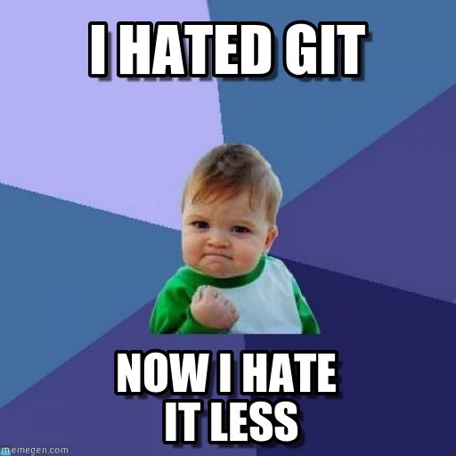

## How to use Git in a project?

I had the opportunity to prepare a presentation of Git and thought it would be great to share it to whoever wants to use it in a project.

It targets beginners (no knowledge is required). It explains the process pipeline, and how to use Gitkraken as a graphic client. The presentation goes through the following subjects:

- What is Git exactly ?
- Git clients
- Gitkraken in depth
- Good practices
- Keeping problems away (tentative)
- Resources

It is available here : [Link](https://drive.proton.me/urls/CFAYMP9JXR#i8EtOUl55MWk)

