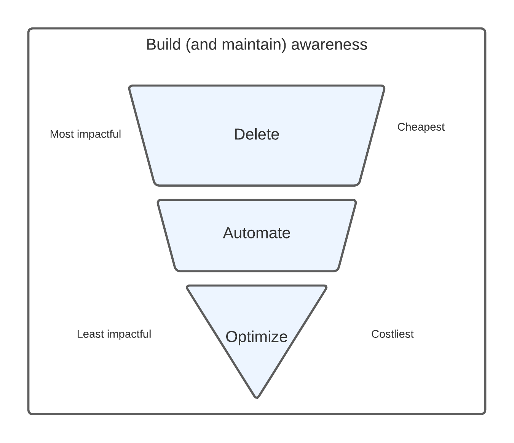
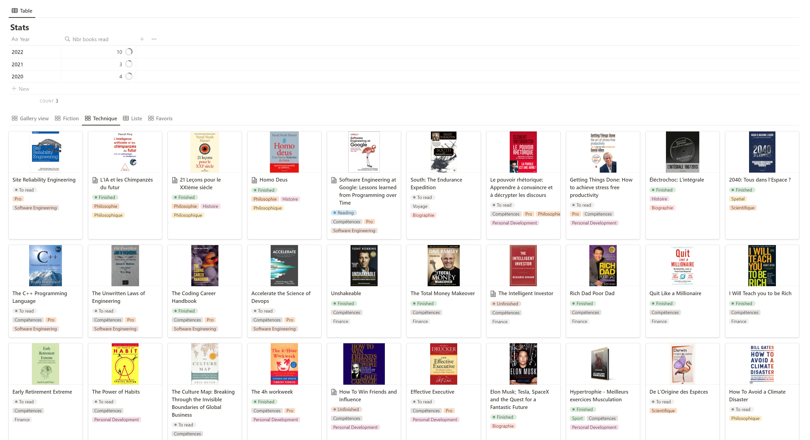
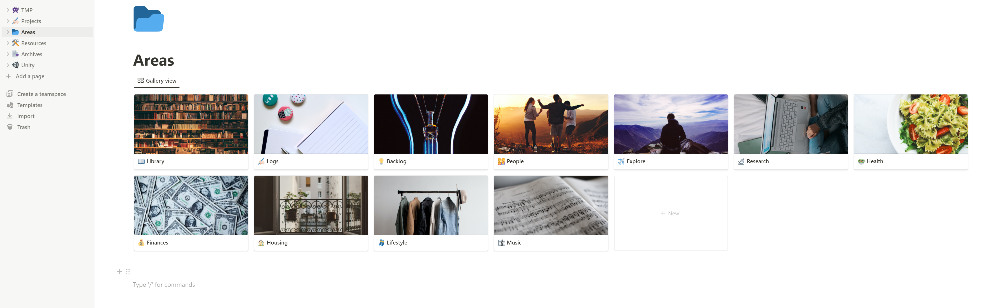

In recent years I've spent more and more time trying to continuously optimize my daily routine. Fixing the pain points, and improving my productivity. At the end of the day, it's all about freeing up more time and being able to focus more on what matters and what I like.

As I was thinking about it, wrapping up 2022, I realized how aligned this life mindset is with my Automation engineering job's principles. At the end of the day, my work is all about freeing up internal customers' time so they can focus on where they provide the highest value (and of course by doing so, saving the company more money).

From these similarities, a **framework** emerges:

1. The first step is collecting data about an issue or something I need to monitor: metrics, reporting, dashboards... you name it. Only then am I able to make the best decision about what action to take, if any. Sometimes there's simply no action to take but monitoring things is good to get a sense of ownership and not forget about what I'm supposed to keep under my radar.

2. Once everything is monitored, as an automation engineer the most valuable contribution I can make is usually to isolate the useless or costly processes or tools and get rid of these. Deleting stuff also has the benefit of being extremely cheap. The same goes with life: anything I don't need can be removed and will result in saving me money or reducing my mental stress.

3. I automate anything remaining, if possible. This means finding a way for a machine to do the job on my behalf. This ensures the outcome will be more consistent, on time, and that I will have time for more valuable tasks. The upfront cost of automation is higher than deleting stuff, but the long-term gains will make up for it. There is of course always a maintenance cost.

4. If there is anything left, only will I do my best to optimize the manual workflow or tool use, so that it at least takes as little time as possible. As the outcome will still rely a lot on human intervention, this is likely the least impactful action, and also the most expensive. Hence why it must come last.

So how am I putting this into practice?

These are some ideas that worked for me. I'm sharing in case they can inspire you too.

## Build awareness

### 💸 Monitor money in, money out

In recent years I've been reading more about personal finances. The book that laid the ground was ["I will teach you to be rich"](https://www.amazon.com/Will-Teach-You-Be-Rich/dp/0761147489), written by Ramit Sethi. The title is a bit cheesy, but the pieces of advice in there are golden, and I recommend giving it a look. A lot of the following tips are actual implementations of the ideas from this book.

#### Monitor subscriptions

We live in a services-based world, and it's easy to forget how much money we put in each month.
I want to keep the list of services I'm subscribed to as short as possible, always being aware of what I use and what I don't, while paying for.

The **[Subscriptions Manager](https://apps.apple.com/us/app/subscriptions-manager/id1502159977)** app made by Darius Buhai is great at this for a one-time fee of 0.99€. Every service I subscribe to goes there. The app sends me reminders when the next billings are due, and aggregates all subscriptions into a monthly total sum. The game is to try decreasing this sum as much as possible by unsubscribing to whatever service I don't need anymore.

#### Monitor wealth

Monitoring long-term wealth building is as important as monitoring daily earnings and expenses. I use **[Finary](https://finary.com/en)**, available both on the phone and on the web. It can track anything, from luxury watches to cryptocurrency to real estate and including liabilities, all for free. The team behind it is french, considerate of security and data privacy, and agile in delivering new features quickly.
It's quite fun to see the progress of my investments on graphs and be incentivized to grow them further.

### 📚 Monitor... everything?

There is a hardcore mode to this: [The quantified-self movement](https://www.reddit.com/r/QuantifiedSelf/), which consists in collecting as many "life" data points as possible. I haven't reached this point yet, and not sure I ever want to, so here are just a few things I'm keeping track of.

#### TV series, films, and books

There are so many TV series out there that it's easy to lose track of my progress. I delegate this to **[TV Time](https://www.tvtime.com/)**, which is free and great for knowing everything about a specific show, from ratings to calendar, to episodes I missed.

With books, the main issue is not to keep track of progress but to be able to link some notes that I'm taking while reading, and have a way to find them easily later on. Some apps provide this service but I want to avoid using too many apps and centralize what can be. So I embedded that "extended digital library" directly in my second brain, Notion (more on that later).

It's nothing more than a giant table where each entry contains the book's metadata, my reading status, some tags, and my notes if any. There are plenty of example [templates](https://www.notion.so/templates/book-tracker) on the web.

I built the one I use and for fun, I added a counter that automatically increases each time I finish up a book. It motivates me to beat my previous years' books count (I can assure you I read more than 3 books in 2021, they're not all in that table... 👀).

#### Places

Quite often I'm coming up across places recommendations - restaurants, museums and whatnot - from friends, or magazines. An app that's great at remembering all these places for me is [Mapstr](https://mapstr.com/). I love the idea of creating my map of places I've already been to and recommend, or that I need to try. It has a social dimension, so I'm able to check all my friends' and family's places. 100% would recommend.

#### Wine

I know I'm not living up to the french standards with this one, but I've been using **[Vivino](https://apps.apple.com/us/app/vivino-buy-the-right-wine/id414461255)** to help me decide which wine to buy depending on the occasion for some time now. From a picture of a bottle I take in the store, it's able to find the correct wine and associated ratings and tasting bits of advice. It's also great at remembering which wines I bought and liked in the past if I ever want to buy the same in the future.

#### Plants

Once upon a time, I owned real plants. Sadly, they all either died or were looking so bad I had to put them in therapy at my parents'. But before things went too far south, I used to use another app to get reminders of when to water each plant. The basic phone reminders could probably also do it, but it gets more difficult to manage as you get more plants.

## **Delete** the unnecessary

### 📲 Configure your phone

#### Keep your apps list as short as possible

I uninstalled all the apps I can access from a computer. Facebook and Linkedin were the first to go away. It's simply too easy to get stuck for hours on these apps on my phone. I prefer the struggle of having to boot up a computer to access them, which is too dissuasive most of the time.

Uninstalling all shopping apps or games shortly followed. Any order or booking I want to make can be done next time I'm in front of a computer. Preferably with the 2 weeks rule: wait 2 weeks before buying something to make sure I truly need/want it.

If I'm not using an app for some time, it's also going away. It's a mental burden to keep up with the notifications and updates, or even to keep the phone organized, with too many apps. The shorter the list of apps, the better.

#### Prefer native apps

Using pre-installed/native apps is a good way to keep that list short. This avoids bloating the phone with tons of third-party apps, that might duplicate (e.g. a third-party clock app). As an extra benefit, the native apps are usually designed with the OS guidelines in mind and are ad-free, so much more user-friendly.

On iOS, my only exceptions are Google Maps, Spotify, and Google Translate. The Apple equivalent apps are just not good enough for me 😔. Hopefully, one day the Apple Maps team will put more focus on adding relevant and missing data to places, and less on rendering the landmarks in 3D.

#### Disable 90% of the notifications

The most valuable currency for apps is attention. Disabling as many notifications as possible guarantees that I will decide when and where to open an app, not the other way around.

This means disabling all unimportant notifications on the lock screen, in the notification center, and also disabling any visual clues incentivizing me to open the app because of FOMO, like those little red dots/notifications count on the app icons.

I disabled notifications from all apps except the messaging app I use with my family and closest friends, and from time-sensitive apps (delivery, taxi).

#### Use grouped notifications

It might be worth grouping all remaining notifications (if any) to have them delivered all at once at fixed hours. iOS is allowing that through "Morning/Evening summaries".

### ✉️ Unsubscribe from e-mail lists

Something that always fascinates me is the number of unread e-mails some people can have, and how it doesn't seem to bother them one second. How easy it must be to miss the important ones among the rest!

I'm maintaining inbox 0 simply by unsubscribing from e-mail lists as much as possible (tiny links at the bottom of each e-mail). The only ones I don't advise unsubscribing from are the ones coming from junky addresses, as it's a way for scammers to know you exist. The anti-spam filters are pretty efficient nowadays so it's only a tiny percentage anyway. If they still come through I usually just block the address and flag these as spam.

### 😪 Put an end to decision fatigue

[The average human is facing 35.000 decisions per day](https://www.psychologytoday.com/us/blog/stretching-theory/201809/how-many-decisions-do-we-make-each-day). I do my best to lower the useless decisions count down, hoping to keep more energy for the important ones.

Something that works for me is progressively replacing mismatching clothes with duplicates of the same items (e.g. having 10 pairs of the same socks). That means no more hesitating about what I'll wear each morning. But this could work for many other aspects of life (e.g. meal preparation).

## What you can't get rid of, **automate**

### 🗃️ E-mails and inbound files management

I make good use of e-mail filtering rules. Expected recurring e-mails (transportation bills...) go into a specific folder that doesn't crowd my main inbox.

Recurring attachments I want to save for future use are extracted automatically from the e-mails I receive and saved to cloud/drive folders. This is especially useful for receipts, bills, or rent documents that come in every month from the same e-mail address. I'm using **[Zapier](https://zapier.com)** to automate this, but there are alternatives, like **[IFTT](https://ifttt.com)**. These are websites allowing to build automated workflows, based on specific triggers, responding to specific rules, and linking different apps together.

### 🎧 Music

Related to the previous point, it's a bit of a niche one, but I'm also using the same apps to automate the saving of my `Discover Weekly` and `Release Radar` playlists on Spotify. They are generated by Spotify each week but it turns out they aren't saved by default, so there's no way to find the curated songs back once they're gone.

I added [another IFTT automated workflow](https://ifttt.com/applets/NFRkZeJu-automatically-create-a-discover-weekly-archive) to add each song that goes into those 2 "on the fly" playlists into other "archive" playlists (really just regular ones). This way I can enjoy previously curated songs anytime I want. The algorithm knows my tastes better than me so it's also a great way to keep a history of the music I liked some months/years ago, and visualize how my tastes evolved.

### 🔐 Use a password manager

Passwords are the most important secrets in our lives, yet they're the most difficult to manage and remember. To be as safe as possible they have to be long, complex, and different on each account/identity.

I use **[Bitwarden](https://bitwarden.com/products/personal/)** as a password manager to do this heavy lifting for me. It's one of the last ones to be free, but I find it safe enough as it's open source and end-to-end encrypted. It provides a web browser extension as well as a phone app, and passwords can be synced between devices.

### 🌐 Web browser extensions

Speaking of web browser extensions, here are the ones I always install on new devices. Or better - they are linked to my firefox account that automatically installs them when I sign in on new devices:

- **[I don't care about cookies](https://addons.mozilla.org/en-US/firefox/addon/i-dont-care-about-cookies/):** It automagically accepts all cookies on all websites for me. This is a must since GDPR came out, and with it, hoards of annoying cookie popups. GDPR is fantastic for consumers and citizens, but on the tech side an internet-wide "opt-in" standard to auto-accept all cookies all the time should exist. This extension emulates such a standard.
- An ad-blocker, _that I disable on websites I care for_. Unfortunately, some industries have pushed the game too far when it comes to ads, to the point where navigation is completely impossible, so this is also a must (cooking websites, I'm talking about you).
- **[Tab Session Manager](https://addons.mozilla.org/en-US/firefox/addon/tab-session-manager/):** Saves all your browsing sessions in case you need them later. Useful when, like me, you're switching context/projects frequently.
- A shopping coupon code auto-filling extension: I use **[Wanteeed](https://wanteeed.com/fr/)** but I don't know if it works for non-french niche websites. It scraps all promotion codes on the internet and automatically tries them one by one on the payment page of any shopping website.
- **[Return YouTube Dislike](https://www.returnyoutubedislike.com/):** Youtube stopped showing the dislikes counts on videos in 2022. This is terrible when looking for any tutorial on something I don't know how to do, and I need to rapidly evaluate its relevance. This extension is bringing the counter back.

### 💤 Sleep better

It's a stretch but I think this fits the "automate" category because it's about automating behaviors, and connected devices can help with that.

I improved my sleep quality by setting up the following workflow:

- When it's bed time, my **[Philips Hue](https://www.philips-hue.com/en-us)** connected bed light automatically turns on.
- All my devices go into Sleep Focus mode, which is an iOS thing that turns all notifications off and changes the wallpaper of all devices. This is an invitation to stop everything I'm doing and take some time to read a book before going to sleep for good.
- My phone stays in the living room and doesn't stay on my bed table anymore. This ensures I stop looking at a blue screen before sleeping, and most of all, that my phone is not the first thing I stare at when waking up.
- I replaced the phone alarm clock with an apple watch that gently vibrates on my wrist instead. The alarm is tied to the focus mode, so disabling one disables the other, if needed. An old school alarm clock would also work, to get rid of the phone (and be cheaper than a watch).
- When it's time to wake up, the bed light smoothly turns on, to accompany the alarm (and to simulate a beautiful savannah sunrise).
- Access to all unimportant apps is blocked before some time in the morning. It's done in the settings of the phone and removes an extra bit of temptation when my brain is still foggy.

This entire automation also ensures that I don't diverge too much from my sleep schedules, as it always triggers at the same time. Sleeping consistency is proven to be the best action one can take to improve its quality.

### 🔔 Work and communicate asynchronously

I try to hunt the [observer pattern](https://refactoring.guru/design-patterns/observer) down in life. Many processes can be done such that I subscribe to a service that is not available or complete yet, and the service gets back to me once it's ready.

This works for apartment hunting. Many websites/apps can send notifications whenever a new place corresponding to my filters is available, or for second-hand purchases (same concept).

Some websites also send notifications whenever some product's price goes lower than some threshold (e.g. **[Le Denicheur](https://ledenicheur.fr/)**). This is super useful for purchases I don't need urgently and I'm keen to wait for a price decrease.

Asynchronicity also works well for communication. I use the delayed send Gmail feature when I want e-mails I wrote over the weekend to arrive on top of my correspondent's inbox on Monday. At work, I usually use delayed messages when reaching out to people outside of my time zone.

## **Optimize** the use of what you can't automate

Some tasks just can't be automated. Either because they don't follow a specific pattern, or because they require too much manual input. So I still have to spend time on these, but I'm doing my best to make the workflows smoother and faster.

### 🧠 Use a second brain and a framework to process information

There is so much information to remember and make sense of out there: projects, appointments, contact info... And only so much a chaotic and unreliable human brain can process.

There are many solutions to delegate that work to a machine, but I use **[Notion](https://www.notion.so)** as my "second brain". It is free for unlimited personal use, but mainly it is so flexible that information can be stored in any desired layout or form. Earlier I said that I built my digital library there, but I also store info about my ongoing projects, trip plans, job hunting, important contacts, courses I took at uni if I ever need to do some research, cooking recipes, etc. This blog post started as a draft in Notion.

Delegating the work of remembering everything to software is nice, but still, how to organize this gigantic knowledge database?

The way I sort and store digital information changed forever when I heard of the [PARA method](https://fortelabs.com/blog/para/), pioneered by Tiago Forte. It is very intuitive to use, but most of all, very scalable. It stands for

- **P**rojects: Everything about a time-framed set of related tasks goes there
- **A**reas: Everything related to a part of my life that doesn't have a deadline or timeline goes there
- **R**esources: Topics of interest
- **A**rchives: Each outdated item from the other categories goes there

Each one of these is a space in my Notion setup. I use separate spaces for my work stuff, but they follow the same layout.
The only missing thing from this framework, to me, is some kind of temporary space, where I can add notes on the fly and miscellaneous items to treat urgently.

So I added an extra "TMP" space, acting as my home page with backlinks to the most important parts of this second brain.

The home page is also holding my todo, organized as follows:

- Todo - Today
- Todo - This week
- Todo - This month
- Waiting (This is only on my work todo, as some items have a dependency on other people or processes)
- Done (each week's done tasks then go to the Archives space)

These categories have the benefit of emphasizing the priority of tasks as well as tying them to some kind of deadline. If a task is lingering in the monthly todo lane for too long, it usually means it can be deleted, as priority was never bumped. According to the [Eisenhower matrix](https://appfluence.com/productivity/what-is-the-eisenhower-method/), these items are usually the non-critical and non-urgent ones.

The key to keeping it as clean as possible is avoiding stale items, both in my todo and on the TMP space. The space is acting as an inbox, but then items or tasks have to either fit into another space or be removed.

### 📁 Digital documents

Notion doesn't handle documents, so I still need a place to store them.
I'm using the same PARA method on my cloud space. I scan all my physical documents and keep the digital copies there. It frees me up physical storing space and ensures I'll always have access to my documents anywhere in the world. Not keeping any physical copy also avoids any accident that could happen to it.

### 📅 Use a calendar

I'm using Google Calendar on desktop, and the native Apple one on the phone. Digital calendars work with e-mail accounts set up as feed sources, so the heavy lifting is done by the e-mail provider. Any calendar interface can be used to subscribe to these sources. I use the following setup:

- I have a personal feed and a work feed. I subscribed to my Facebook events feed, and to various public calendar feeds (french national holidays...).
- They all show up on a single interface, saving me the hassle of going back and forth between different calendars when booking events.
- Also, my contacts' birthdays are correctly set up in my contacts list, so they show up as well.

Having different calendar feeds is useful to separate all "areas" of my life. I used to have a source for my university classes. One could also use a family feed, it works for everything.

### 🔖 Bookmark important links

I'm keeping a record of all interesting websites I visited [there](https://www.notion.so/theo-pnv/Bookmarks-4d8fefa50ed8421f896e9bbed212e8e7) (in Notion!). That way I'm able to quickly go back to previously used resources in case I need them for my new projects. It saves the hassle of doing the same job twice.

## Closing thoughts

I wouldn't be able to say how many hours or days these few life hacks saved me so far. And I don't think it should be the main metric to assess whether or not they're useful. All I know is they provide me with a life framework in which it's easier to reason and not get lost. I know where to look when I need to find something. And each time something new is coming up I generally know what to do with it. In the end, it's less clutter and more energy for what I like doing. Of course, to each their own, and these tips won't work for everyone.

I don't think life automation is a finished process, similar to how there's always some work to do as an automation engineer. It's all about continuously building on top of previous achievements and working towards the perfect workflows, without ever reaching them.

Progress > State.
