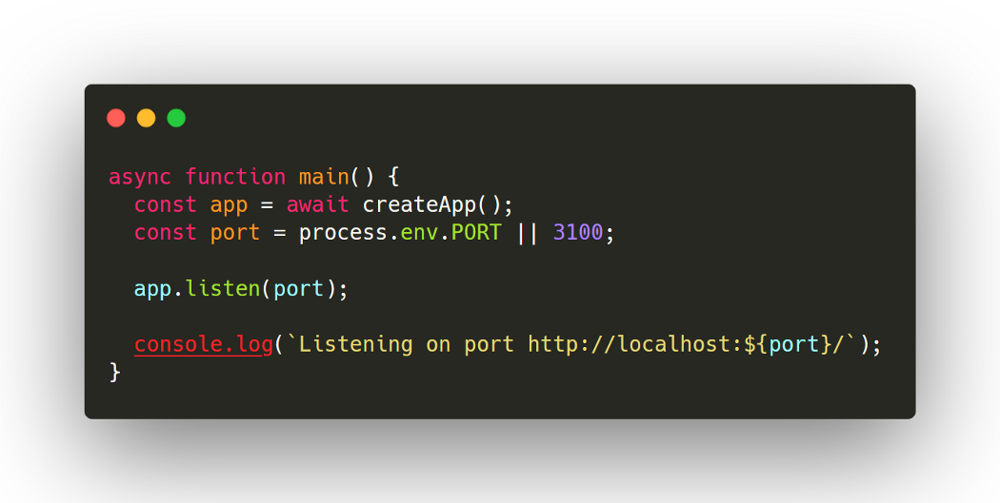

_If you want to use the server starter directly without going through the tutorial, find the code on [Github](https://github.com/theo-pnv/nodejs-server-starter). Link to the next parts are at the bottom of this page._

I recently needed to build a server for a side project. Building the foundation to provide generic features any server is expected to deliver ended up being a new side project by itself!

Today there are many great tools to build a robust and versatile back-end, and plenty documentation available. However it is hard to find tutorials for building a generic back-end, with very little configuration needed to adapt it to any business application. It is also hard to find info about grouping all the different tools and frameworks needed together. This tutorial is nothing more than a summary of all the tribal knowledge spread out there.

Let’s cover this topic, by building only the foundation of our server, which will then be easily extensible and using a modern tech stack:

- With [Koa.js](https://koajs.com/) we will implement our main logic. It is the core of our server and it will tie all the components together.
- [MongoDB](https://www.mongodb.com/) will allow us to manage a database to store and retrieve information.
- [GraphQL](https://www.apollographql.com/) will allow us to implement an API to interact with this database. Coupling GraphQL with Typescript will allow us to use [GraphQL Code Generator](https://www.graphql-code-generator.com/) to have a single source of truth for our GraphQL, Typescript and MongoDB models. 🤯
- Using [Mocha](https://mochajs.org/), we will ensure our server behaves correctly by testing both our GraphQL endpoints and our MongoDB CRUD methods (database accessors).
- [Docker](https://www.docker.com/) will facilitate the deployments and the installation of all the tools for each developer of the team, without asking them to install a bunch of software on their machine.
- Everything has to be written in [Typescript](https://www.typescriptlang.org/), as it is more comfortable to work with strongly typed Javascript, and cheaper and faster to detect potential errors at compile-time rather than at runtime.
- We will also cover some Quality Of Life (QOL) tooling: this means using tools like eslint, git hooks and nodemon. It will speed up the iterations when writing code.

Using all these tools together will make our server starter generic enough to be used for all kinds of projects, with an efficient development and deployment workflow. There are many steps, so this tutorial will be broken down into multiple chapters. Try not to be discouraged by the big picture and to see each one of the chapters as a small bit that is very easy to set up individually. Let’s get started!

_Some requirements: knowing the basics in javascript/typescript, using git and working with an IDE. The node version used for this tutorial is 15.0.1 and the npm version is 6.14.9._

## Getting started: a Typescript-ready project

First things first, create a git repository, and run `npm init`. You can then safely remove the “main” and “scripts.test” entries from the package.json file, as we will rewrite them later.

Make the project Typescript ready by running

```
npm i -D typescript @types/node
```

"i" stands for install and “-D” for save as a devDependency. Indeed, we won’t need the typescript package at runtime, only at compile time and when developing. Registering as many packages as possible as devDependencies will later save some space in the Docker container of our app.

> How does Typescript work with Node?

We will write all our files in typescript (.ts), and compile them with the TypeScript Compiler (tsc). It will output the generated javascript (.js) files into a folder that Node can read.

This means we need a [tsconfig.json](https://www.typescriptlang.org/docs/handbook/tsconfig-json.html) file to configure the compilation. Copy/paste the following into `tsconfig.json`:

```json
{
  "compilerOptions": {
    "lib": ["ES2019"],
    "target": "ES2019",
    "module": "commonjs",
    "esModuleInterop": true,
    "moduleResolution": "node",
    "sourceMap": true,
    "outDir": "dist"
  },
  "include": ["src/"],
  "exclude": ["node_modules"]
}
```

Basically we’re asking `tsc` to include all files inside `src` and to put the generated files into the `dist` folder.

Let’s add our first script to our `package.json`. We will now be able to build our typescript project by running `npm run build`:

```json
"scripts": {
  "build": "tsc -p ."
}
```

## 🐨 Koa.js

But in order to compile something we need sources! Let’s create a basic Koa.js server. Run

```sh
npm i koa koa-router @types/koa-router
```

and create an `src` folder, with a `server.ts` file inside.

```js
import Koa from "koa";
import KoaRouter from "koa-router";

async function main() {
  const app = await createApp();
  const port = process.env.SERVER_PORT || 3100;

  app.listen(port);

  console.log(`Listening on port http://localhost:${port}`);
}

async function createApp(): Promise<Koa> {
  const app = new Koa();
  const router = new KoaRouter();

  router.get("/health", (ctx: { body: string }) => {
    ctx.body = "ok";
  });

  app.use(router.routes());
  app.use(router.allowedMethods());

  return app;
}

main();
```

It’s quite straightforward. By hovering on any object in your IDE you can see that everything is strongly typed! Do not mind the `process.env.SERVER_PORT` now, it will be useful later. Just remember that until we define this variable somewhere, the OR part (`||`) will be used, in that case, 3100.

Let’s try running `npm run build`, and then `node ./dist/server.js` to start the server. The `console.log()` call at line 10 should output the server’s URL. Browse `http://localhost:3100/health` to use our only route and verify that we have an “Ok” with a 200 HTTP response.

## Some Quality of Life (QoL) tooling

From now on we’d like to ensure our code always meets some quality standards. Nicely formatted code = better readability, no irrelevant git changes like spaces and extra lines, and happier developers. Also, running `npm run build` and starting the server manually each time is not a great workflow. Let’s remediate to that.

### 📃 Enforce the code convention

Let’s add eslint to our project. It will make sure the code convention is enforced. Run

```sh
npm i -D eslint @typescript-eslint/eslint-plugin @typescript-eslint/parser
```

and create a `.eslintrc` file:

```json
{
  "root": true,
  "parser": "@typescript-eslint/parser",
  "plugins": ["@typescript-eslint"],
  "extends": [
    "eslint:recommended",
    "plugin:@typescript-eslint/eslint-recommended",
    "plugin:@typescript-eslint/recommended"
  ],
  "rules": {
    "no-console": ["error", { "allow": ["warn", "error"] }]
  }
}
```

A couple of things:

- We are using the code convention of the extensions listed under `extends`. This is recommended for all typescript projects, and there are many other extensions available.
- We can add as many custom rules as we want. For instance, I like making sure all the console.log() calls are removed in the final code, to avoid the typical `console.log("debug")` calls (or worse 😉).

To enforce these rules instantly when you are writing some code, you will need to [install the ESLint plugin](https://eslint.org/docs/user-guide/integrations) in your IDE.

You will also need a `.eslintignore` file, in which you’ll list the folders to exclude from the linting. Add `node_modules` and `dist`, as we don’t want to lint the files the typescript compiler generated.

Now you may notice an eslint error in `src/server.ts` (with VSCode you have to restart the editor to see ESLint errors after installing it):



As we’d like to keep this valuable output to know if the server actually started or not, we can make it an exception. Add the following line just before the console.log() call:

```json
// eslint-disable-next-line no-console
```

We’re now ready to add another script to the package.json’s scripts section:

```json
"lint": "eslint . --fix"
```

Run `npm run lint` to automatically fix all fixable code convention errors and report the others.

### Avoid pushing ill-formatted code to the remote

Wouldn’t it be nice if the linting job was run each time we committed some files, in order to make sure we only save clean code? Let’s add some git hooks. They are small scripts that trigger on specific git actions (commit, push…).

Adding [husky](https://github.com/typicode/husky) to our project is the easiest way to make everyone in the team use git hooks: `npm i -D husky`. Add the following section to your package.json:

```json
"husky": {
  "hooks": {
    "pre-commit": "tsc --noEmit && npm run lint"
  }
}
```

Now each time we git commit some files, typescript will complain if it can’t compile the code into javascript and the linter will complain if we aren’t complying with the rules listed in our `.eslintrc`. Add more hooks if you need to, even post-commit or pre-push ones.

_Note: As of writing (25/11/2020), [husky won’t install the hooks due to an issue with npm v7](https://github.com/typicode/husky/issues/788). Use npm v6 or use another way to install the hooks (e.g. https://pre-commit.com/)._

### 🔄 Set up hot reload

Last but not least of our QoL improvements, we want to set up hot reload so that the server reloads automatically when we edit some code. Let’s install [nodemon](https://www.npmjs.com/package/nodemon):

```sh
npm i -D nodemon ts-node
```

We need ts-node to run typescript directly without compiling it into javascript first. Create the `nodemon.json` file:

```json
{
  "watch": ["src"],
  "ext": "ts",
  "ignore": [".git", "node_modules"],
  "exec": "npx ts-node ./src/server.ts"
}
```

Add the following script to the package.json:

```json
"start": "nodemon"
```

And run `npm run start` to start the server. Now, each modification you make to the source code will automatically reload the server in a few seconds. Pretty handy!

Part 1? Done. We built a basic server that can handle HTTP routing, and we are ready to write some clean and strongly-typed code. Yay! 🎊

However we still need many other tools to provide features like an API (graphQL) that will allow accessing a database (MongoDB). Adding these tools will make the server hard to deploy, so containerization will also be useful. Click the link below to jump to part II to set these things up.

[Building a Node.js Server — Part 2/4: Docker](../nodejs-server-02/)
