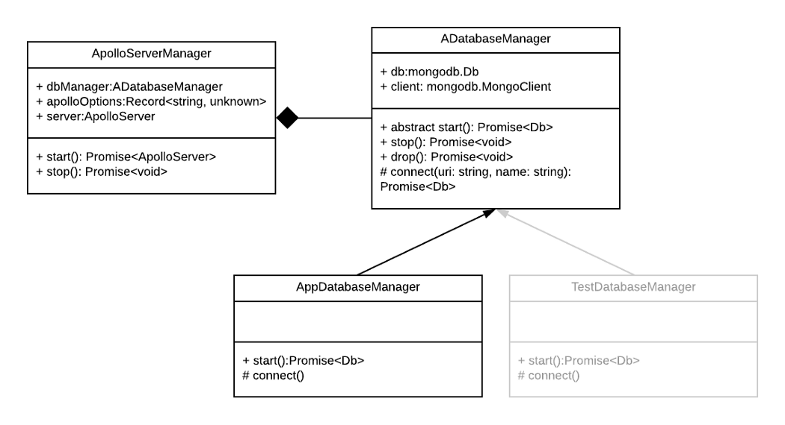

_If you want to use the server starter directly without going through the tutorial, find the code on [Github](https://github.com/theo-pnv/nodejs-server-starter). Link to the next parts are at the bottom of this page._

In [Part I](../nodejs-server-01) and [II](../nodejs-server-02) we didn’t write much code. Time to write some boilerplate code, and to make our first queries to the MongoDB database through the GraphQL API. There’s no easy way to proceed step by step with this chapter, but everything will make sense at the end.

Requirements: Knowing the basics of [GraphQL (Apollo)](https://www.apollographql.com/docs/apollo-server/) and of the [MongoDB driver for NodeJS](https://docs.mongodb.com/drivers/node/current/).

# GraphQL Code-Generator

Let’s install the packages we need for this chapter all at once:

```sh
npm i graphql mongodb apollo-server-koa apollo-datasource-mongodb @graphql-tools/schema @graphql-codegen/typescript-mongodbnpm i -D @graphql-codegen/cli @graphql-codegen/typescript @graphql-codegen/typescript-resolvers @types/mongodb
```

The first thing we need to do when writing a GraphQL API is to define a schema. Let’s create and open `src/graphql/types.ts`. As our goal is to have a very generic server that can serve any purpose, we won’t dive too deeply into the schema. It is up to you to extend it to meet your needs. However, we can assume that one of the requirements of many apps is to have a basic user management. We will use that for starters and as an example. Our API will expose 2 methods: a GraphQL query to retrieve a specific user from the database from their name, and a GraphQL mutation to insert a user into the database.

```js
import { gql } from "apollo-server-koa";

export default gql`
  type Query {
    user(name: String): User
  }
  type Mutation {
    addUser(name: String!): User!
  }
  type User @entity {
    _id: String! @id
    name: String! @column
  }
`;
```

[GraphQL Code Generator](https://www.graphql-code-generator.com/) is a neat tool that will generate our Typescript types and MongoDB models, from the schema. It is really nice because it makes the GraphQL schema the single source of truth for our server, API and database. It can even be used to generate some code in the client project (e.g. mobile app, website…).

It only needs a configuration file, in which we will pin the path to the schema file and list the plugins we want to use. In order to generate MongoDB models, we need the “[typescript-mongodb](https://www.graphql-code-generator.com/plugins/typescript-mongodb)” one. Note, it is thanks to the `@entity` attribute in the schema file that the plugin knows User is a collection in the database. Add a `codegen.yml` file at the root:

```json
overwrite: true
schema: "./src/graphql/types.ts"
generates:
  src/generated/types.ts:
    plugins:
      - "typescript"
      - "typescript-resolvers"
      - "typescript-mongodb"
```

Add the `npm run codegen` command in the package.json file and run it to generate the types in `src/generated/types.ts`:

```json
"codegen": "graphql-codegen --config codegen.yml"
```

You may want to add the `src/generated` folder to the `.eslintignore` file.

# Connect to the Apollo Server and Database instance

Now that we have our database and API types let’s take a break to see how we will build our server.



We will instantiate an ApolloServerManager, which will handle the GraphQL schema and resolvers. It will also use the DatabaseManager we pass it to connect to the MongoDB instance. We will abstract the DatabaseManager to be able to provide a different database for our tests (we will take care of that in part IV, don’t pay it attention for now. It is only here to understand why the abstraction). We can delegate the ownership of the DatabaseManager to the ApolloServerManager because Apollo provides a [“Data sourcing” mechanism](https://www.apollographql.com/docs/apollo-server/data/data-sources/), so our Apollo server will directly use the database helpers we provide.

It can be a little bit difficult to visualize so let’s jump into the code!

## Database managers

Create a `src/DatabaseManager.ts` file:

```js
import { Db, MongoClient } from "mongodb";

abstract class ADatabaseManager {
  db: Db;
  client: MongoClient;

  abstract start(): Promise<Db | null>;

  async connect(uri: string, name: string): Promise<Db | null> {
    this.client = new MongoClient(uri, {
      useNewUrlParser: true,
      useUnifiedTopology: true,
    });
    try {
      await this.client.connect();
      this.db = this.client.db(name);
      return this.db;
    } catch (err) {
      console.error(err);
    }
    return null;
  }

  async stop(): Promise<void> {
    await this.client.close();
  }

  async drop(): Promise<void> {
    this.db.dropDatabase();
  }
}

class AppDatabaseManager extends ADatabaseManager {
  readonly uri: string = `mongodb://${process.env.MONGO_DATABASE_USERNAME}:${process.env.MONGO_DATABASE_PASSWORD}@${process.env.DB_HOSTNAME}:${process.env.MONGO_PORT}/${process.env.MONGO_INITDB_DATABASE}`;

  async start(): Promise<Db | null> {
    return super.connect(this.uri, process.env.MONGO_INITDB_DATABASE);
  }
}

export { ADatabaseManager, AppDatabaseManager };
```

1. We’re using the MongoDB driver for NodeJS to instantiate a MongoClient. The methods are pretty standard lifecycle methods, to start and stop the client. We can’t really connect to the client in the constructors because the connect() method is async. So we need to call a dedicated start() method manually.
2. To build the connection string needed by MongoDB to connect to our database container, we’re using the environment variables we defined in the .env file.

## Apollo Server manager

Time to write our GraphQL API.

We need to define some CRUD methods to interact with the database (they’re called [Datasources](https://www.apollographql.com/docs/apollo-server/data/data-sources/) by Apollo). They will be called by our GraphQL resolvers. Create an `src/datasource/User.ts` file:

```js
import { MongoDataSource } from "apollo-datasource-mongodb";
import { FilterQuery, ObjectId } from "mongodb";
import { UserDbObject } from "../generated/types";

interface Context {
  loggedInUser: UserDbObject;
}

export default class User extends MongoDataSource<UserDbObject, Context> {
  async findOne(query: FilterQuery<UserDbObject>): Promise<UserDbObject | null> {
    try {
      const user = await this.collection.findOne(query);
      if (!user) {
        console.error(`User.findOne(${query}) failed because record does not exist.`);
      }
      return user;
    } catch (err) {
      console.error(`User.findOne(${query}) failed with error ${err}.`);
    }
    return null;
  }

  async insertOne(args: Pick<UserDbObject, "name"> & { _id?: ObjectId }): Promise<UserDbObject | null> {
    try {
      const result = await this.collection.insertOne(args);
      return this.findOneById(result.insertedId);
    } catch (err) {
      console.error(`User.createOne(${args}) failed with error ${err}.`);
    }
    return null;
  }
}
```

- For the `findOne` method, we are basically encapsulating MongoDB’s NodeJS driver’s `findOne` method to fetch users with a query.
- Same or the `insertOne` method, except that instead of a query we’re passing arguments (the new user) to MongoDB’s insertOne method.
- Note that we’re importing the `UserDbObject` from our generated types. 😎
- There’s some basic error management but feel free to add more checks.

We then need to define GraphQL’s resolvers and typedefs, in `src/graphql/schema.ts`:

```js
import { DIRECTIVES } from "@graphql-codegen/typescript-mongodb";
import { makeExecutableSchema } from "@graphql-tools/schema";
import types from "./types";

const resolvers = {
  Query: {
    user: (_, args, { dataSources }) =>
      dataSources.users.findOne({ name: args.name }),
  },
  Mutation: {
    addUser: async (_, args, { dataSources }) =>
      dataSources.users.insertOne(args),
  },
};

const schema = makeExecutableSchema({
  typeDefs: [DIRECTIVES, types],
  resolvers,
});

export default schema;
```

- The DIRECTIVES declaration is needed by the code generator to properly map the entities. That’s why we saved this package in the regular dependencies (it is needed at runtime).
- Our GraphQL clients will be able to query `user(name: $name)` and to call the `addUser(name: $name)` mutation.
- We’re using the datasources we defined in `src/datasource/User.ts` to link our GraphQL API to the database and return something to the clients.

Last file I promise! Now comes the actual ApolloServerManager (`src/ApolloServerManager.ts`):

```js
import { ApolloServer } from "apollo-server-koa";
import { GraphQLError, GraphQLFormattedError } from "graphql";
import { ADatabaseManager } from "./DatabaseManager";
import User from "./datasource/User";
import schema from "./graphql/schema";
import Koa from "koa";
import { DataSources } from "apollo-server-core/dist/graphqlOptions";

class ApolloServerManager {
  dbManager: ADatabaseManager;
  apolloOptions: Record<string, unknown>;
  server: ApolloServer;

  constructor(
    dbManager: ADatabaseManager,
    apolloOptions: Record<string, unknown> = {}
  ) {
    this.dbManager = dbManager;
    this.apolloOptions = apolloOptions;
  }

  async start(): Promise<ApolloServer> {
    const dataSources = await this.dataSources();
    this.server = new ApolloServer({
      schema,
      formatError: this.formatError,
      context: this.context,
      dataSources: dataSources,
      ...this.apolloOptions,
    });
    return this.server;
  }

  async stop(): Promise<void> {
    await this.server.stop();
  }

  // eslint-disable-next-line @typescript-eslint/ban-types
  async dataSources(): Promise<() => DataSources<object>> {
    const db = await this.dbManager.start();
    return () => ({
      users: new User(db.collection("users")),
    });
  }

  context({ ctx }: { ctx: Koa.Context }): { ctx: Koa.Context } {
    // TODO: Authenticate and populate user, for instance:
    // ...
    // return { ctx, loggedUser }
    return { ctx };
  }

  formatError(err: GraphQLError): GraphQLFormattedError {
    console.error("Error while running resolver", {
      error: err,
    });

    // Hide all internals by default
    return new Error("Internal server error");
  }
}

export default ApolloServerManager;
```

- Line 24, we’re instantiating the actual ApolloServer. We are passing it our schema, a context pre-populated by Koa, the datasources and an error handler callback.
- Ideally we would add authentication and populate some loggedUser field in the context, but that’s out of this tutorial’s scope. See Apollo’s tutorial for how to do that.

# Run our GraphQL and MongoDB powered back-end

That was a lot. All that’s left to do is to instantiate an ApolloServerManager and an AppDatabaseManager in the `src/server.ts` file:

```js
import { AppDatabaseManager } from "./DatabaseManager";
import ApolloServerManager from "./ApolloServerManager";

// ....

async function createApp(): Promise<Koa> {
  const app = new Koa();
  const router = new KoaRouter();
  const serverManager = new ApolloServerManager(new AppDatabaseManager(), {
    introspection: !(process.env.NODE_ENV === "production"),
    playground: !(process.env.NODE_ENV === "production"),
  });
  const server = await serverManager.start();

  router.post("/graphql", server.getMiddleware());
  router.get("/graphql", server.getMiddleware());
  router.get("/health", (ctx: { body: string }) => {
    ctx.body = "ok";
  });

  app.use(router.routes());
  app.use(router.allowedMethods());

  return app;
}

// ...
```

We’re instantiating the ApolloServer with introspection and playground on for development, so that we can use [GraphiQL](https://github.com/graphql/graphiql) to run test queries and mutations against our server. Don’t forget to also add the graphql routes.

Let’s see if everything runs fine:

Run `docker-compose up -d database mongo-express` and `npm run start`. Head over to `http://localhost:$SERVER_PORT/graphql` and see if the GraphiQL playground appears. You can then run the addUser mutation:

```js
# Write your query or mutation here
mutation AddUser($name:String!) {
  addUser(name:$name) {
    _id
    name
  }
}
```

Add the following variables in the “Query Variables” area at the bottom:

```json
{
  "name": "Batman"
}
```

If GraphQL effectively returned the inserted user after running the mutation, head over to `http://localhost:8081` (our mongo-express service) and check the database/users collection. Yay, we have a Batman! 🦇 You can also query the Batman through our API:

```js
# Write your query or mutation here
query User($name:String!) {
  user(name:$name) {
    _id
    name
  }
}
```

Congrats, we’ve built a good base for the server of any business application. We’ve added many features and kept everything super generic, so you could in theory stop here, duplicate this starter for each new project and build on top of the very basic user API we built with GraphQL and MongoDB.

If you’re interested in seeing how we can test the whole infrastructure, click the link below to head over to part IV! ⏩
[Step-by-step: Building a Node.js server (2021 edition) — Part 4/4 — Testing](../nodejs-server-04/)
