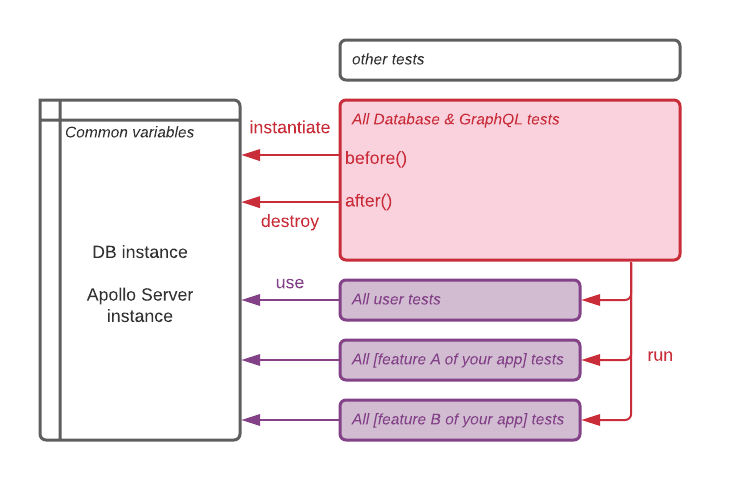
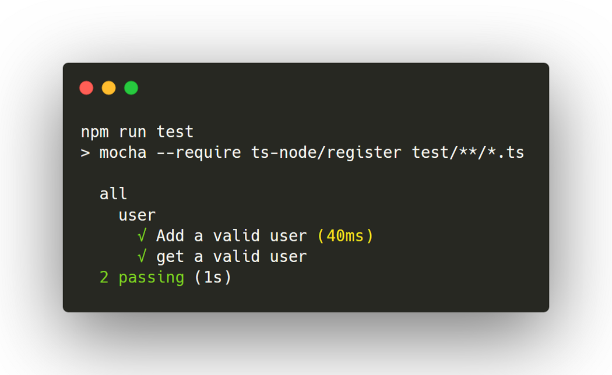

_If you want to use the server starter directly without going through the tutorial, find the code on [Github](https://github.com/theo-pnv/nodejs-server-starter). Link to the next parts are at the bottom of this page._

In [Part I](../nodejs-server-01) to [III](../nodejs-server-03) we built a generic server with the help of Koa.js, GraphQL, MongoDB and Docker. Let’s add some tests with Mocha to make sure we don’t introduce regressions when we add more code.

Requirements: Understanding why testing is important (😉).

## ☕ Mocha Setup

[Mocha](https://mochajs.org/) is a javascript test runner. We will use it to test both our graphQL resolvers and database accessors, to ensure the server is responding as we expect. We also have to add an assertion library, because Mocha does not have one bundled. We will use [Chai](https://www.chaijs.com/), as it’s very popular and there’s plenty tutorial/resources available for learning it.

Let’s add the following packages:

```sh
npm i -D mocha chai @types/mocha @types/chai apollo-server-testing mongodb-memory-server
```

- We will use [apollo-server-testing](https://www.apollographql.com/docs/apollo-server/testing/testing/) to mock a GraphQL client.
- To mock the database without using/conflicting with the development one, we will use [mongodb-memory-server](https://github.com/nodkz/mongodb-memory-server). It will create a temporary MongoDB database in the RAM for our tests.

Let’s add the test command to our scripts in the package.json file:

```json
"test": "mocha --require ts-node/register test/**/*.ts"
```

We need to use ts-node to transpile typescript into javascript mocha can read.

We also want to exclude the `test` folder from the docker copy and typescript compilation. This means adding test to the excluded folders section of `tsconfig.json` and to the list in `.dockerignore`.

## Writing the tests

Mongo-memory-server is super useful to quickly set up a temporary database that will only live in the host’s RAM during the tests. Create a `test/TestDatabaseManager.ts` file and copy/paste the following code:

```js
import { Db } from "mongodb";
import { MongoMemoryServer } from "mongodb-memory-server";
import { ADatabaseManager } from "../src/DatabaseManager";

class TestDatabaseManager extends ADatabaseManager {
  mongod: MongoMemoryServer;

  constructor() {
    super();
    this.mongod = new MongoMemoryServer();
  }

  async start(): Promise<Db | null> {
    const uri = await this.mongod.getUri();
    return super.connect(uri, "test");
  }

  async stop(): Promise<void> {
    await super.stop();
    await this.mongod.stop();
  }
}

export default TestDatabaseManager;
```

Similarly to the AppDatabaseManager we already wrote for our actual server, the TestDatabaseManager inherits from ADatabaseManager. Instead of using MongoDB’s NodeJS driver to connect to a real database, we’re using MongoMemoryServer to generate a temporary database (named “test”) and a connection string (uri).

Regarding the actual tests, we’d like to connect to the test database before running them, as well as disconnect when they are done. We’d also like to clean the database between each test. To solve this, Mocha is providing [“hooks”](https://mochajs.org/#hooks) that will allow us to run some code before and after all the tests, and even in between.

The ideal architecture would be to split tests into multiple files and still be able to benefit from the hooks and access the common variables in each one of the files:



Let’s create a file (corresponding to the red one above) called `test/all_db.test.ts` and add the following code:

```js
import "mocha";
import { createTestClient } from "apollo-server-testing";
import ApolloServerManager from "../src/ApolloServerManager";
import options from "./common";
import TestDatabaseManager from "./TestDatabasemanager";

function importTest(name, path) {
  describe(name, function () {
    require(path);
  });
}

describe("all", function () {
  before(async function () {
    options.dbManager = new TestDatabaseManager();
    options.serverManager = new ApolloServerManager(options.dbManager);
    const server = await options.serverManager.start();
    options.testClient = createTestClient(server);
  });
  after(async function () {
    await options.dbManager.stop();
    await options.serverManager.stop();
  });
  beforeEach(async function () {
    const collections = options.dbManager.db.collections;
    for (const key in collections) {
      await options.dbManager.db.dropCollection(key);
    }
  });
  importTest("user", "./user.test");
  // That's where you would add more tests, dependending on your business needs.
});
```

- Mocha is using “describe(name, suite)” to create a suite of tests. The “all” suite is encapsulating all the other suites (the “user” one at line 30, and we can add as many as we want using the `importTest()` function).
- In `before`, we are instantiating `dbManager` because we will need it to access the database in the tests.
- We are creating a test client, provided by apollo-server-testing (and relying on the TestDatabaseManager). We will use this test client to test our GraphQL API.
- In `after`, we are properly cleaning the resources we used.
- In `beforeEach`, we are cleaning the database. It ensures there’s no data left from the previous test when executing the tests one by one.

Let’s add `test/common.ts`:

```js
import TestDatabaseManager from "./TestDatabasemanager";
import ApolloServerManager from "../src/ApolloServerManager";
import { ApolloServerTestClient } from "apollo-server-testing";

interface Options {
  dbManager: TestDatabaseManager;
  serverManager: ApolloServerManager;
  testClient: ApolloServerTestClient;
}

const options: Options = {
  dbManager: null,
  serverManager: null,
  testClient: null,
};

export default options;
```

It is simply a data class, holding the variables we need for our tests.

The last file we need to add is the actual user test file (`test/user.test.ts`), containing 2 tests:

```js
import "mocha";
import { gql } from "apollo-server-koa";
import { expect } from "chai";
import { ObjectId } from "mongodb";
import { UserDbObject } from "../src/generated/types";
import options from "./common";

it("Add a valid user", async () => {
  // Preparation
  const user = { name: "John" };
  const ADD_USER = gql`
    mutation addUser($name: String!) {
      addUser(name: $name) {
        _id
        name
      }
    }
  `;

  // GraphQL
  const { data } = await options.testClient.mutate({
    mutation: ADD_USER,
    variables: {
      ...user,
    },
  });
  expect(ObjectId.isValid(data.addUser._id)).to.be.equal(true);
  expect(data.addUser.name).to.be.equal(user.name);

  // Database
  const dbUser = await options.dbManager.db
    .collection<UserDbObject>("users")
    .findOne({ name: user.name });
  expect(ObjectId.isValid(dbUser._id)).to.be.equal(true);
  expect(dbUser.name).to.be.equal(user.name);
});

it("get a valid user", async () => {
  // Preparation (insert a new user in DB)
  const result = await options.dbManager.db
    .collection<UserDbObject>("users")
    .insertOne({ name: "John" });
  const dbUser = await options.dbManager.db
    .collection<UserDbObject>("users")
    .findOne({ _id: result.insertedId });
  const GET_USER = gql`
    query User($name: String) {
      user(name: $name) {
        _id
        name
      }
    }
  `;

  // GraphQL
  const { data: { user } } = await options.testClient.query({
    query: GET_USER,
    variables: {
      name: "John",
    },
  });
  expect(ObjectId.isValid(user._id)).to.be.equal(true);
  expect(user.name).to.be.equal(dbUser.name);
});
```

- From line 8 to 36, we are testing the `addUser` endpoint. First by testing the GraphQL mutation, and what it is returning (by comparing `data` and `user`). Then, by checking that an entry was created in the database (comparing `dbUser` and `user`).
- From line 38 to 64, we are testing the `user` endpoint.
- If you need more info about how the testClient is working, check [Apollo’s official documentation](https://www.apollographql.com/docs/apollo-server/testing/testing/). Basically we are using the `query` and `mutate` functions that `createTestClient()` is returning us, to mock a GraphQL client.

Now we can run `npm run test` and see our tests running 😎.



That’s it! We covered many topics in these articles, and we now have a generic foundation that can easily be extended to meet any need. 🥳

We won’t cover the deployment since there are already a ton of resources available out there. It should be pretty straightforward because our whole back-end is containerized. Let me know if you would like to know more about it.

Thank you for making it to the end. I hope you learned something along the way, and I would love to hear your input and feedback if some things could be done better using other techniques. Big thanks to the authors of these articles too, they were very valuable resources to build this tutorial and I recommend them to everyone:

- [How to set up a powerful API with GraphQL, Koa and MongoDB](https://medium.com/better-programming/how-to-setup-a-powerful-api-with-graphql-koa-and-mongodb-339cfae832a1), by Indrek Lasn.
- [Smooth Local Development with Docker-Compose, Seeding, Stubs and Faker](https://phauer.com/2018/local-development-docker-compose-seeding-stubs/), by Philip Hauer.
- [This StackOverflow answer](https://stackoverflow.com/questions/24153261/joining-tests-from-multiple-files-with-mocha-js/26791892#26791892) about nesting the Mocha tests, by Louis.
