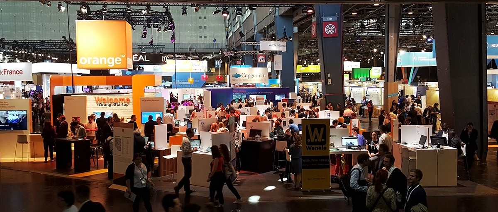
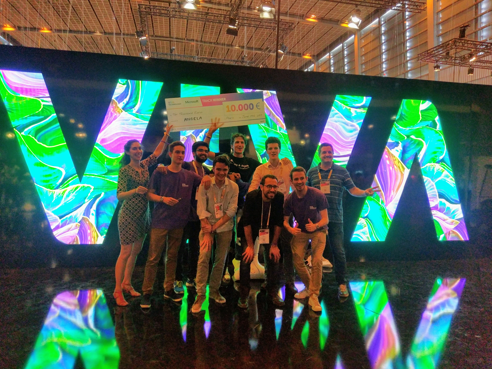

# Can Vivatechnology make Paris tech again?

VivaTechnology is an event that takes place in Paris, every year in June, since 2016. Its main goal is to bring together the players in the Tech ecosystem. It brings together big groups – Orange, Airbus, Google, Microsoft, IBM and many more – as well as startups, contractors, and investors. There’s even a day where the public is welcomed. An opportunity for everyone to discover the latest innovations in multiple fields : energy, luxury, food, transports…

## Business...

The event was organized in a way that let people exchange very easily. My main goal, along with taking a pulse of the next tendencies in tech, was to find a part-time for the fall. It was very easy to talk with a lot of interesting people at stands, and I left with a lot of business cards, acquired in just a few hours. Special thanks to the mobile app developed for the event, and which was almost a social network on its own. It allowed the participants to “connect” while they met (and exchange later), and to be informed of the hours, location, topics of events.

These events were in majority talks, on interesting topics and with well-known speakers (Eric Schmidt for Alphabet, Bernard Arnault for LVMH, Daniel Zhang for Alibaba, …).

## ... And Tech

Furthermore the event hosted a hackathon, with four challenges sponsored by big groups (Axa, Cisco, Microsoft and Sodexo). The participants had to build a team of speakers, developers and designers. Then they had to come with a solution for a given problem, all of this in less than 24 hours. I had the opportunity to win the 1st prize of the Microsoft’s challenge, with my team! We prototyped a chatbot, called Angela, to improve the relations between co-workers, and unite them around their shared hobbies. It was my first experience of hackathons, and a great one! We didn’t sleep, so it was very exhausting at the end, but we never gave up, and kept working as a team. I really hope to participate in other challenges like this one.

I really enjoyed the time spent at this event, and think my friends did too. Vivatechnology keeps getting bigger each year, and there was a lot more communication on it in 2017. It gathers a lot of different people, coming from different horizons, and having different goals. Bringing these people together is a great alternative to Las Vegas’s CES, or Barcelone’s MWC, which only focus on hardware/software.
